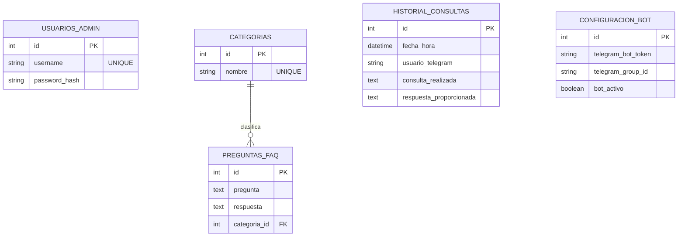

# Manual Técnico - SmartBot FAQ

**Universidad de San Carlos de Guatemala**  
**Facultad de Ingeniería - Escuela de Ciencias y Sistemas**  
**Inteligencia Artificial 1**  
**Estudiante:** Daniel Gálvez - 202203361

---

## 1. Descripción General del Sistema

**SmartBot FAQ** es una plataforma integral diseñada para la automatización en la resolución de preguntas frecuentes mediante un asistente virtual en Telegram. El sistema se compone de una API RESTful para la gestión del conocimiento (CRUD), una base de datos relacional para la persistencia, un panel administrativo web y un hilo de ejecución en segundo plano (Daemon) que opera como el cerebro conversacional del bot, comunicándose directamente con la API oficial de Telegram sin intermediarios.

Todo el ecosistema está encapsulado y orquestado mediante **Docker Compose**, lo que garantiza su portabilidad y fácil despliegue.

---

## 2. Arquitectura Implementada

El código fuente está organizado aplicando los principios de separación de responsabilidades, encapsulamiento y orquestación mediante contenedores.

```text
Practica2/
 ├── backend/                       # Capa de integración, API RESTful y Daemon (FastAPI)
 │   ├── config/                    # Configuración de conexión y persistencia (SQLAlchemy)
 │   ├── models/                    # Definición de entidades ORM (MVC - Modelo)
 │   ├── routers/                   # Endpoints HTTP y controladores (MVC - Controlador)
 │   ├── services/                  # Lógica de negocio, motor ILIKE y Daemon de Telegram
 │   ├── .env.example               # Plantilla de variables de entorno
 │   ├── Dockerfile                 # Definición de imagen de contenedor para el backend
 │   ├── main.py                    # Punto de entrada ASGI y orquestador de hilos
 │   ├── requirements.txt           # Dependencias de Python (FastAPI, bcrypt, requests)
 │   └── seed_data.py               # Script de poblado inicial de la base de datos
 ├── frontend/                      # Capa de presentación, Panel Administrativo (React)
 │   ├── public/                    # Recursos estáticos globales e iconos
 │   ├── src/                       # Código fuente de la aplicación SPA
 │   │   ├── api/                   # Cliente HTTP (Axios) para consumo de endpoints
 │   │   ├── assets/                # Imágenes y recursos gráficos locales
 │   │   ├── components/            # Componentes reutilizables de la UI (Notificaciones)
 │   │   ├── App.jsx                # Componente raíz y gestor de estado global
 │   │   ├── main.jsx               # Punto de entrada de React en el DOM
 │   │   └── index.css              # Estilos globales de la aplicación
 │   ├── Dockerfile                 # Imagen multi-stage (Build Vite + Serve Nginx)
 │   ├── package.json               # Dependencias de Node.js y scripts de ejecución
 │   └── vite.config.js             # Configuración del bundler y proxy de desarrollo
 ├── docs/                          # Documentación técnica, manuales y evidencias
 │   ├── images/                    # Capturas de pantalla del sistema en ejecución
 │   ├── 0-arch.drawio              # Diagrama fuente de la arquitectura del sistema
 │   ├── Manual_Tecnico.md          # Documentación de arquitectura, lógica y despliegue
 │   └── Practica 2 - IA1 JUNIO.pdf # Enunciado oficial de la práctica
 └── docker-compose.yml             # Orquestador de contenedores (DB, Backend, Frontend)
```

### 2.1 Patrón Arquitectónico (Cliente-Servidor + MVC)


El sistema adopta una arquitectura Cliente-Servidor donde el Backend funge como el núcleo orquestador. Internamente, el backend implementa el patrón **Modelo-Vista-Controlador (MVC)** para garantizar una estricta separación de responsabilidades:

- **Modelos (`models/`):** Representaciones ORM de las entidades de la base de datos (SQLAlchemy).
- **Vistas:** Desacopladas del backend. Consisten en la Interfaz Web (React) y la interfaz conversacional de Telegram. Ambas consumen la misma capa de datos.
- **Controladores (`routers/` y `services/`):** Exponen los endpoints HTTP para la administración web y la lógica de inferencia/búsqueda del bot de Telegram.

### 2.2 Tecnologías Utilizadas

- **Backend / API:** Python 3.11, FastAPI, Uvicorn, SQLAlchemy.
- **Base de Datos:** PostgreSQL 15.
- **Frontend:** React, Vite, Axios.
- **Bot Conversacional:** Long Polling manual vía HTTP Requests (Requests library).
- **Seguridad:** bcrypt (hashing de contraseñas), variables de entorno (`.env`).
- **DevOps:** Docker, Docker Compose, Nginx.

---

## 3. Modelo Relacional de Base de Datos

El almacenamiento del conocimiento y la auditoría se gestiona en **PostgreSQL**, garantizando integridad referencial y soporte para búsquedas de texto eficientes (`ILIKE`).

### 3.1 Diagrama Entidad-Relación (ER)



### 3.2 Descripción de Entidades Principales

1. **PreguntasFAQ y Categorías:** Constituyen la base de conocimiento. Relación 1:N donde una categoría agrupa múltiples preguntas. La eliminación de categorías está restringida si posee preguntas asociadas.
2. **HistorialConsulta:** Tabla de auditoría inmutable. Registra el timestamp, usuario de Telegram, entrada recibida y salida procesada.
3. **ConfiguracionBot:** Tabla *singleton* (único registro) que almacena dinámicamente los tokens y parámetros operativos del bot, permitiendo su modificación en caliente sin reiniciar el contenedor.

---

## 4. Lógica de Integración del Bot de Telegram

Para cumplir con las restricciones del proyecto, la integración con Telegram se desarrolló **desde cero**, sin uso de librerías especializadas (ej. `python-telegram-bot`).

### 4.1 Bucle de Long Polling

El bot opera en un hilo secundario (`threading.Thread(daemon=True)`) que arranca junto con el servidor FastAPI.

- Mantiene una conexión abierta con `api.telegram.org/.../getUpdates`.
- Utiliza el parámetro `offset` para procesar mensajes de forma secuencial y evitar pérdida de eventos.
- Si el sistema detecta que el bot fue desactivado desde el panel web, el hilo entra en modo reposo (`time.sleep`) sin consumir recursos.

### 4.2 Motor de Búsqueda (ILIKE)

Cuando el usuario ingresa texto libre, el sistema ejecuta una consulta en la base de datos utilizando el operador `ILIKE` de PostgreSQL, permitiendo coincidencias parciales insensibles a mayúsculas/minúsculas. Si hay coincidencia, retorna la respuesta; de lo contrario, envía un mensaje de *fallback* controlado.

### 4.3 Menús Dinámicos (Inline Keyboards)

El sistema intercepta comandos como `/preguntas` y construye dinámicamente un bloque JSON (`reply_markup`) consultando la tabla de `Categorías`. Cuando el usuario interactúa, Telegram dispara un evento `callback_query` que el backend atrapa para devolver las preguntas correspondientes a esa categoría.

### 4.4 Auditoría Inmediata

Cada interacción (texto libre o pulsación de botón) dispara dos eventos asíncronos:

1. Escritura inmediata en la tabla `HistorialConsulta`.
2. Reenvío del log estructurado (en formato HTML para evitar fallos de parseo de Telegram) al Grupo de Auditoría configurado en el sistema.

---

## 5. Endpoints de la API REST

El panel administrativo (React) consume la siguiente API estructurada en FastAPI:

| Módulo | Endpoint | Método | Descripción |
|--------|----------|--------|-------------|
| **Auth** | `/auth/login` | POST | Validación segura (bcrypt) de administrador. |
| **Categorías** | `/categorias/` | GET, POST | Lectura y creación de agrupaciones. |
| | `/categorias/{id}` | PUT, DELETE | Edición de nombre y eliminación restringida. |
| **Preguntas** | `/preguntas/` | GET, POST | Lectura (con JOIN a categoría) y creación. |
| | `/preguntas/{id}` | PUT, DELETE | Actualización total y borrado de registros. |
| **Bot** | `/configuracion/` | GET, PUT | Lectura y escritura en caliente de Tokens. |
| **Auditoría** | `/estadisticas/historial` | GET | Recuperación de logs para el frontend. |
| | `/estadisticas/resumen` | GET | Métricas agregadas (Dashboard). |

---

## 6. Despliegue y Ejecución (Docker)

El ecosistema utiliza tres contenedores definidos en `docker-compose.yml`:

1. **db:** Base de datos persistida mediante volúmenes.
2. **backend:** Carga la API y ejecuta automáticamente `seed_data.py` en su primer arranque para inyectar conocimiento base.
3. **frontend:** Imagen multi-stage que compila React y lo sirve estáticamente con Nginx.

### Instrucciones de Despliegue Local

1. Clonar el repositorio.
2. Asegurar la existencia del archivo `backend/.env` con las variables de base de datos.
3. Ejecutar el orquestador en la raíz del proyecto:

```bash
docker compose up --build -d
```

4. El panel administrativo estará expuesto en `http://localhost`.
5. El sistema inicializará automáticamente 3 categorías y 20 preguntas base listas para operar.

---

## 7. Evidencias del Sistema


