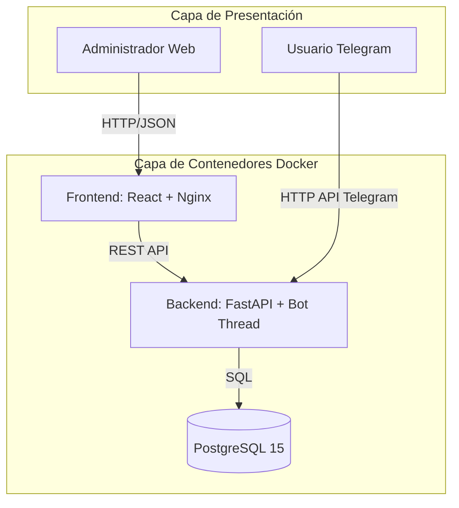
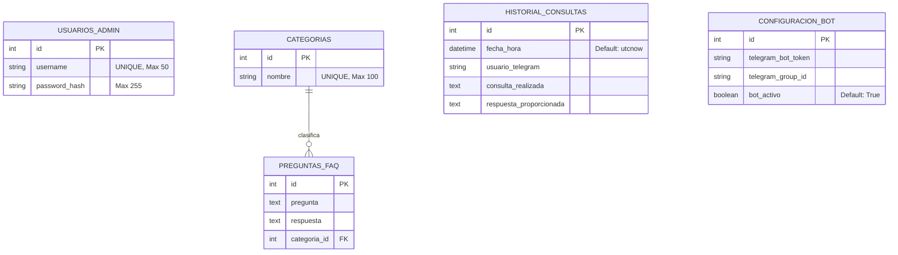
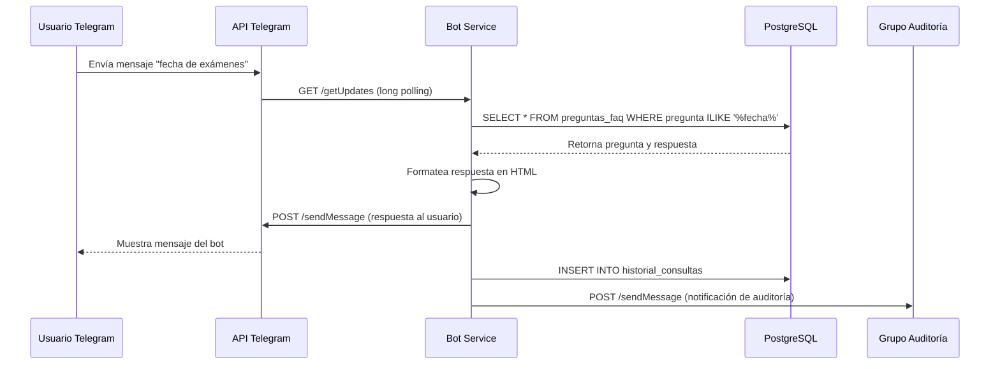
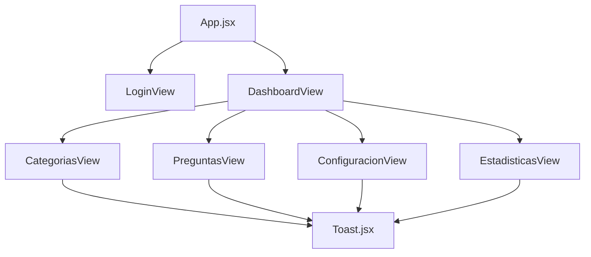
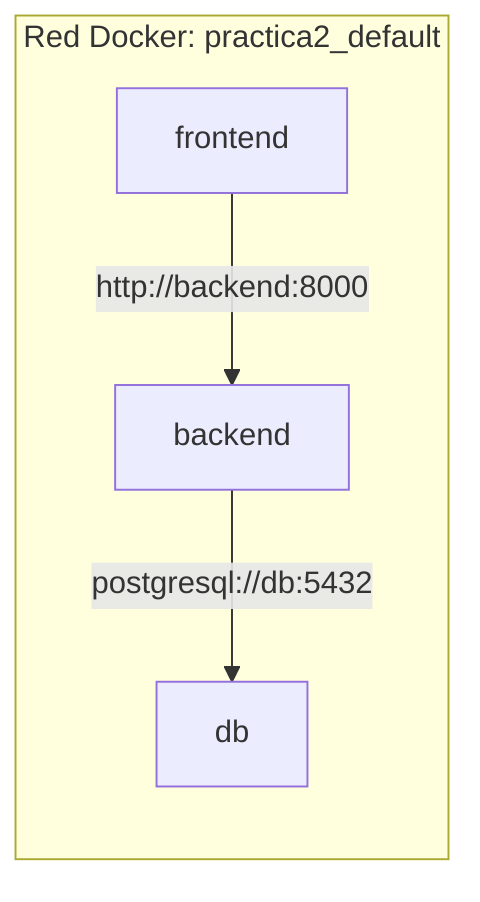
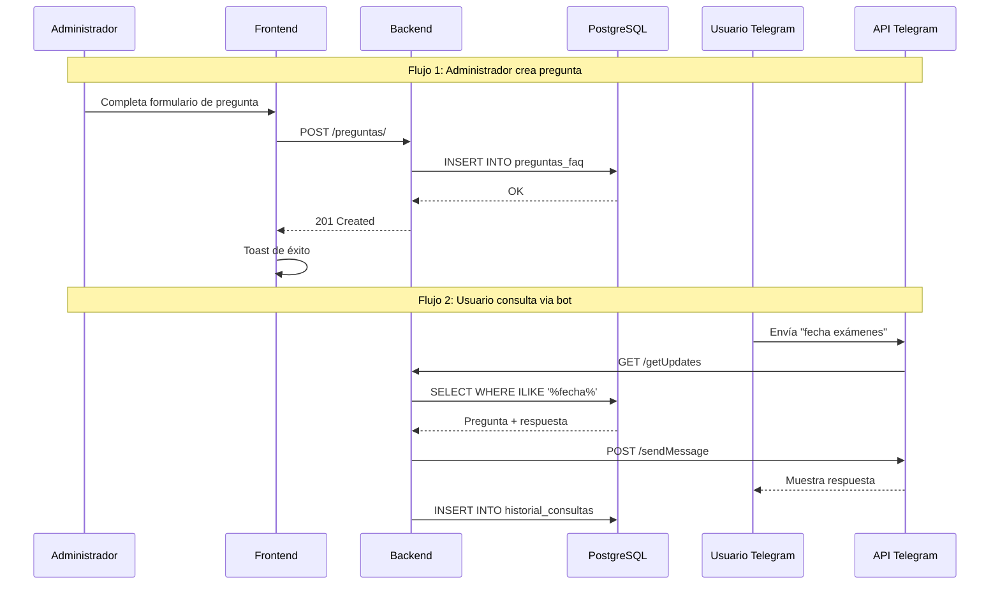

# Manual Técnico - SmartBot FAQ (IA1)

**Universidad de San Carlos de Guatemala**
**Facultad de Ingeniería - Escuela de Ciencias y Sistemas**
**Inteligencia Artificial 1**
**Estudiante:** Daniel Gálvez - 202203361

---

## 1. Introducción

El presente documento describe la arquitectura, estructura e integración del sistema **SmartBot FAQ**, desarrollado para la resolución del problema de atención automatizada de preguntas frecuentes mediante un bot conversacional. El sistema implementa una solución híbrida donde **PostgreSQL** actúa como el repositorio de conocimiento persistente, **Python (FastAPI)** funciona como capa de integración bajo un patrón MVC, **React** conforma la interfaz gráfica de administración, y un **Bot de Telegram** implementado desde cero actúa como motor de inferencia conversacional. Todo el ecosistema se orquesta mediante **Docker Compose** para garantizar portabilidad y reproducibilidad.

---

## 2. Arquitectura Implementada

### 2.1 Patrón de Arquitectura: Cliente-Servidor con MVC en Backend y Orquestación por Contenedores

El proyecto evoluciona de un diseño monolítico tradicional a una arquitectura **Cliente-Servidor con el backend estructurado bajo el patrón Modelo-Vista-Controlador (MVC)**, complementada con un tercer actor: un **bot de Telegram** que opera como consumidor interno de la capa de datos. Todo el sistema se despliega mediante Docker Compose, lo que añade una capa de infraestructura como código (IaC).



### 2.2 Justificación del Patrón

* **Desacoplamiento estricto**: PostgreSQL almacena el conocimiento de forma relacional, FastAPI orquesta el tráfico web y el bot, React dibuja la interfaz administrativa. Ninguna capa asume responsabilidades de la otra.
* **Mantenibilidad MVC**: Separar las rutas HTTP (`routers/`), la lógica de negocio del bot (`services/`) y los moldes de datos (`models/`) facilita la escalabilidad y lectura del código.
* **Portabilidad mediante contenedores**: Docker Compose garantiza que el sistema funcione idénticamente en cualquier entorno (desarrollo, laboratorio, servidor de producción) sin configurar dependencias manualmente.
* **Cumplimiento de restricciones**: Se garantiza que el bot no utiliza librerías de terceros como `python-telegram-bot`, cumpliendo con el requerimiento técnico de implementar comunicación HTTP pura con la API oficial.

### 2.3 ¿Por qué MVC y no una arquitectura monolítica?

La decisión de implementar MVC responde a necesidades específicas del proyecto, amplificadas por la presencia de dos clientes concurrentes (el panel web y el bot de Telegram):

**Separación de Responsabilidades:**

* **Modelo (`models/models.py`)**: Centraliza la definición del esquema relacional mediante SQLAlchemy. Si cambian las reglas de integridad (por ejemplo, una categoría debe tener nombre único), solo se modifica en un lugar y se propaga automáticamente a todas las capas que consumen los modelos.
* **Vista (React + Telegram)**: Ni el panel web ni el bot conocen detalles de la base de datos. Ambos consumen estructuras JSON o registros ORM. Esto permite cambiar el motor de base de datos (por ejemplo, migrar a MySQL) sin tocar ni el frontend ni el bot.
* **Controlador (`routers/`)**: Orquesta las peticiones HTTP del panel administrativo. Si mañana se agrega autenticación JWT real, solo se modifican los routers, no el bot ni los modelos.

**Ventajas para este proyecto específico:**

1. **Doble consumidor de la capa de datos**: Tanto los endpoints REST como el bot de Telegram consultan las mismas tablas (`PreguntaFAQ`, `Categoria`, `HistorialConsulta`). MVC permite que ambos compartan los modelos sin duplicar lógica.
2. **Testing independiente**: Se puede probar el bot simulando mensajes de Telegram sin levantar el frontend, y probar la API REST sin interactuar con Telegram.
3. **Escalabilidad**: Si se requiere agregar un nuevo canal (WhatsApp, Discord), solo se crea un nuevo servicio en `services/` reutilizando los mismos modelos y lógica de negocio.

**Comparación con alternativa monolítica:**

En un diseño monolítico, una función que responde a un usuario de Telegram tendría que:
* Recibir el mensaje desde el long polling
* Validar el formato
* Consultar la base de datos
* Formatear la respuesta en HTML
* Manejar errores de red de Telegram
* Registrar la auditoría
* Enviar el mensaje de vuelta

Con MVC + Services, cada responsabilidad está aislada: el `bot_service.py` coordina, los `models` proveen datos, y `enviar_mensaje()` encapsula la comunicación con Telegram.

### 2.4 Modelo Arquitectónico Complementario: Microservicios Containerizados

Adicionalmente al patrón MVC en el backend, el sistema completo adopta una **arquitectura de microservicios containerizados**. Cada componente vive en su propio contenedor Docker con responsabilidades bien definidas:

| Contenedor | Responsabilidad | Imagen Base |
|-----------|-----------------|-------------|
| `db` | Persistencia de datos relacionales | `postgres:15-alpine` |
| `backend` | API REST + Bot de Telegram | `python:3.11-slim` |
| `frontend` | Panel administrativo web | Multi-stage (Node + Nginx) |

Esta arquitectura permite escalar cada componente de forma independiente. Por ejemplo, si el bot de Telegram recibe miles de mensajes simultáneos, se podría escalar horizontalmente el contenedor `backend` sin afectar al panel web ni a la base de datos.

---

## 3. Estructura del Proyecto

El código fuente está organizado siguiendo los principios de separación de concerns (SoC) y modularidad, facilitando la colaboración en equipo y el mantenimiento a largo plazo.

### 3.1 Estructura General

```text
Practica2/
 ├── backend/                 # Capa de integración, API REST y bot
 ├── frontend/                # Capa de presentación (React + Vite + Nginx)
 ├── docs/                    # Documentación del proyecto
 │   └── Practica 2 - IA1 JUNIO.pdf  # Enunciado de la práctica
 └── docker-compose.yml       # Orquestador de contenedores
```

### 3.2 Estructura del Backend (Python + FastAPI + PostgreSQL)

```text
backend/
 ├── config/
 │   └── database.py          # Configuración de SQLAlchemy y sesión
 ├── models/
 │   └── models.py            # Modelos ORM (Capa Modelo del MVC)
 ├── routers/
 │   ├── auth.py              # Autenticación (Capa Controlador)
 │   ├── categorias.py        # CRUD de categorías (Capa Controlador)
 │   ├── preguntas.py         # CRUD de preguntas FAQ (Capa Controlador)
 │   ├── configuracion.py     # Gestión del bot (Capa Controlador)
 │   └── estadisticas.py      # Auditoría y métricas (Capa Controlador)
 ├── services/
 │   └── bot_service.py       # Lógica del bot de Telegram (Capa Servicio)
 ├── main.py                  # Punto de entrada ASGI de FastAPI
 ├── seed_data.py             # Script de inicialización de datos
 ├── Dockerfile               # Definición del contenedor backend
 └── requirements.txt         # Dependencias de Python
```

#### Descripción detallada de cada archivo:

**`config/database.py`**

Es el módulo encargado de la gestión de la conexión a PostgreSQL. Sus responsabilidades son:
* Crear el `engine` de SQLAlchemy con la URL de conexión al contenedor `db`.
* Definir `SessionLocal` como fábrica de sesiones con `autocommit=False` y `autoflush=False`.
* Declarar la clase `Base` para que los modelos ORM se registren en ella.
* Proveer la función `get_db()` como dependencia inyectable en los endpoints, garantizando el cierre automático de sesiones.

**Configuración de conexión:**
```python
SQLALCHEMY_DATABASE_URL = "postgresql://postgres:adminpassword@db:5432/smartbotdb"
```
El hostname `db` corresponde al nombre del servicio definido en `docker-compose.yml`, resolviéndose automáticamente gracias al DNS interno de Docker.

**`models/models.py`**

Contiene las definiciones de los modelos ORM usando **SQLAlchemy**. Actúa como la capa Modelo del patrón MVC. Define cinco entidades principales:

* `UsuarioAdmin`: Representa a los administradores del sistema con username único y contraseña hasheada.
* `Categoria`: Agrupación lógica de preguntas FAQ con restricción UNIQUE en el nombre.
* `PreguntaFAQ`: Conocimiento del bot, vinculado a una categoría mediante Foreign Key.
* `HistorialConsulta`: Registro de auditoría de cada interacción del bot.
* `ConfiguracionBot`: Tabla singleton que almacena el token de Telegram, el ID del grupo de auditoría y el estado activo/inactivo del bot.

**Relaciones declaradas:**
```python
class Categoria(Base):
    # ...
    preguntas = relationship("PreguntaFAQ", back_populates="categoria")

class PreguntaFAQ(Base):
    # ...
    categoria = relationship("Categoria", back_populates="preguntas")
```
Esta relación bidireccional permite navegar desde una categoría a sus preguntas y viceversa, aprovechando los JOINs automáticos de SQLAlchemy.

**`routers/auth.py`**

Contiene los endpoints HTTP relacionados con la autenticación. Actúa como capa Controlador:
* `POST /auth/login`: Valida credenciales contra el hash bcrypt almacenado y retorna un token de sesión simulado.

**Implementación de verificación segura:**
```python
def verificar_password(plain_password: str, hashed_password: str) -> bool:
    return bcrypt.checkpw(
        plain_password.encode('utf-8'), 
        hashed_password.encode('utf-8')
    )
```

**`routers/categorias.py`**

Endpoints CRUD para categorías:
* `GET /categorias/`: Lista todas las categorías.
* `POST /categorias/`: Crea una nueva categoría validando unicidad del nombre.
* `PUT /categorias/{id}`: Actualiza el nombre de una categoría existente.
* `DELETE /categorias/{id}`: Elimina una categoría, con restricción de integridad referencial si tiene preguntas asociadas.

**`routers/preguntas.py`**

Endpoints CRUD para preguntas FAQ:
* `GET /preguntas/`: Lista todas las preguntas enriquecidas con el nombre de su categoría (JOIN automático).
* `POST /preguntas/`: Crea una pregunta vinculada a un `categoria_id`.
* `PUT /preguntas/{id}`: Actualiza pregunta, respuesta o categoría asignada.
* `DELETE /preguntas/{id}`: Elimina una pregunta específica.

**`routers/configuracion.py`**

Endpoints para gestión del bot:
* `GET /configuracion/`: Retorna el estado actual (token, group_id, bot_activo).
* `PUT /configuracion/`: Actualiza la configuración en caliente, permitiendo apagar o encender el bot sin reiniciar el contenedor.

**`routers/estadisticas.py`**

Endpoints de auditoría:
* `GET /estadisticas/historial`: Retorna el log de interacciones ordenado por fecha descendente.
* `GET /estadisticas/resumen`: Calcula métricas agregadas (total de consultas, usuarios únicos de Telegram).

**`services/bot_service.py`**

Es el núcleo conversacional del sistema. Sus responsabilidades son:
* Iniciar un hilo daemon (`threading.Thread`) que ejecuta el bucle de long polling.
* Comunicarse con la API oficial de Telegram mediante `requests`.
* Procesar comandos (`/start`, `/ayuda`, `/preguntas`) y mensajes de texto libre.
* Gestionar Inline Keyboards y Callback Queries para menús interactivos.
* Ejecutar búsquedas `ILIKE` en la base de datos.
* Registrar cada interacción en `HistorialConsulta`.
* Notificar al supergrupo de auditoría configurado.

**`main.py`**

Es el punto de entrada ASGI de la aplicación FastAPI. Sus responsabilidades son:
* Instanciar la aplicación FastAPI.
* Configurar el middleware CORS para permitir peticiones desde React.
* Registrar todos los routers de la API.
* Ejecutar el evento `startup` que:
  1. Reintenta la conexión a PostgreSQL (hasta 5 intentos con 3 segundos de espera).
  2. Crea las tablas si no existen (`Base.metadata.create_all`).
  3. Crea el usuario administrador por defecto si no existe.
  4. Ejecuta el script `seed_data.py` para poblar datos iniciales.
  5. Inicia el hilo del bot de Telegram.

**`seed_data.py`**

Script de inicialización que se ejecuta en el evento `startup`:
* Verifica si la tabla `categorias` está vacía.
* Si lo está, inserta 3 categorías de ejemplo y 20 preguntas FAQ distribuidas.
* Garantiza que el bot tenga conocimiento útil desde el primer segundo de ejecución.
* Evita duplicados en reinicios posteriores.

**`Dockerfile` (backend)**

```dockerfile
FROM python:3.11-slim
WORKDIR /app
COPY requirements.txt .
RUN pip install --no-cache-dir -r requirements.txt
COPY . .
EXPOSE 8000
CMD ["uvicorn", "main:app", "--host", "0.0.0.0", "--port", "8000"]
```

**`requirements.txt`**

Lista las dependencias de Python necesarias:
* `fastapi`: Framework web asíncrono.
* `uvicorn[standard]`: Servidor ASGI con soporte de WebSockets.
* `sqlalchemy`: ORM para PostgreSQL.
* `psycopg2-binary`: Driver de PostgreSQL.
* `bcrypt`: Hashing seguro de contraseñas.
* `pydantic`: Validación de datos.
* `requests`: Cliente HTTP para comunicarse con la API de Telegram.

### 3.3 Estructura del Frontend (React + Vite + Nginx)

```text
frontend/
 ├── public/
 │   ├── favicon.svg          # Ícono de la pestaña del navegador
 │   └── icons.svg            # Sprite de íconos SVG reutilizables
 ├── src/
 │   ├── api/
 │   │   └── api.js           # Cliente axios configurado
 │   ├── assets/
 │   │   ├── hero.png         # Imagen principal del dashboard
 │   │   ├── react.svg        # Logo de React
 │   │   └── vite.svg         # Logo de Vite
 │   ├── components/
 │   │   └── Toast.jsx        # Componente de notificaciones emergentes
 │   ├── App.css              # Estilos del componente raíz
 │   ├── App.jsx              # Componente raíz con lógica de estado
 │   ├── index.css            # Estilos globales
 │   └── main.jsx             # Punto de entrada de React
 ├── Dockerfile               # Multi-stage build: Node + Nginx
 ├── eslint.config.js         # Configuración ESLint
 ├── index.html               # Plantilla HTML base
 ├── package.json             # Dependencias Node.js
 ├── package-lock.json        # Lockfile de dependencias
 ├── README.md                # Documentación del frontend
 └── vite.config.js           # Configuración del bundler Vite
```

#### Descripción detallada de cada archivo:

**`public/`**

Carpeta de recursos estáticos que se sirven directamente sin procesamiento:
* `favicon.svg`: Ícono que aparece en la pestaña del navegador.
* `icons.svg`: Sprite de íconos SVG reutilizables mediante referencias `<use>`.

**`src/api/api.js`**

Cliente HTTP centralizado construido con **axios**. Características clave:

```javascript
const API_URL = import.meta.env.VITE_API_URL || 'http://127.0.0.1:8000';

const apiClient = axios.create({
  baseURL: API_URL,
  headers: { 'Content-Type': 'application/json' },
});
```

* **Configuración dinámica**: Usa la variable de entorno `VITE_API_URL` en tiempo de build. Si no está definida, usa `http://127.0.0.1:8000` por defecto.
* **Funciones exportadas**: Cada endpoint del backend tiene su función correspondiente (`loginAdmin`, `obtenerCategorias`, `crearPregunta`, etc.), encapsulando las peticiones HTTP.
* **Manejo de errores centralizado**: Los errores HTTP se propagan al componente llamador para ser mostrados mediante el componente `Toast`.

**`src/components/Toast.jsx`**

Componente reutilizable que renderiza notificaciones emergentes. Captura los mensajes de éxito o error provenientes de las peticiones HTTP y los muestra con temporizador de auto-cierre (3 segundos).

**`src/App.jsx`**

Es el componente raíz de la aplicación. Contiene:
* La lógica de estado principal (autenticación, categorías, preguntas, historial).
* Las llamadas HTTP a la API REST mediante el cliente axios.
* La suscripción a los eventos de notificaciones Toast.
* La lógica de renderizado condicional: muestra el formulario de login si no hay token, o el dashboard principal si el usuario está autenticado.

**`src/App.css` y `src/index.css`**

Hojas de estilo que definen la apariencia visual:
* `index.css`: Estilos globales (reset CSS, tipografía, variables de color).
* `App.css`: Estilos específicos del layout principal, paneles de control y tablas.

**`src/main.jsx`**

Punto de entrada de React. Su única responsabilidad es montar el componente `App` en el elemento raíz del DOM (`<div id="root">` en `index.html`).

**`index.html`**

Plantilla HTML base de la Aplicación de Página Única (SPA). Contiene el contenedor donde React inyectará la interfaz y las etiquetas `<script>` que cargan los bundles generados por Vite.

**`package.json`**

Manifiesto del proyecto Node.js. Define:
* **Dependencias de producción**: React, axios.
* **Dependencias de desarrollo**: Vite, ESLint, plugin de React.
* **Scripts de ejecución**: `npm run dev` (desarrollo), `npm run build` (producción).

**`Dockerfile` (frontend) - Multi-stage Build**

```dockerfile
# Etapa 1: Construcción
FROM node:18-alpine AS builder
WORKDIR /app
COPY package*.json ./
RUN npm ci
COPY . .
RUN npm run build

# Etapa 2: Servidor de producción
FROM nginx:alpine
COPY --from=builder /app/dist /usr/share/nginx/html
EXPOSE 80
CMD ["nginx", "-g", "daemon off;"]
```

Este enfoque multi-stage reduce drásticamente el tamaño de la imagen final:
1. **Etapa builder**: Instala todas las dependencias de Node.js y compila React a archivos estáticos optimizados.
2. **Etapa final**: Solo copia los archivos estáticos compilados a una imagen mínima de Nginx, descartando todo el toolchain de Node.js.

**Ventajas del multi-stage build:**
* La imagen final pesa ~25MB en lugar de ~300MB.
* Mayor seguridad: el entorno de desarrollo no está presente en producción.
* Mejor rendimiento: Nginx es más eficiente que el servidor de desarrollo de Vite para servir archivos estáticos.

**`vite.config.js`**

Configuración del bundler Vite. Define:
* El puerto de desarrollo (por defecto 5173).
* Las reglas de resolución de módulos.
* Plugins específicos para React (soporte de JSX y Fast Refresh).

---

## 4. Modelo de Datos y Persistencia

### 4.1 Diagrama Entidad-Relación



### 4.2 Descripción de Tablas y Restricciones

**Tabla `usuarios_admin`**

Almacena las credenciales de los administradores del sistema.

| Campo | Tipo | Restricciones | Propósito |
|-------|------|---------------|-----------|
| `id` | INTEGER | PRIMARY KEY | Identificador único autoincremental |
| `username` | VARCHAR(50) | UNIQUE, NOT NULL, INDEX | Nombre de usuario para login |
| `password_hash` | VARCHAR(255) | NOT NULL | Hash bcrypt de la contraseña |

**Nota de seguridad**: Las contraseñas nunca se almacenan en texto plano. Se utiliza bcrypt con salt automático, que es resistente a ataques de rainbow tables.

**Tabla `categorias`**

Agrupación lógica de preguntas FAQ.

| Campo | Tipo | Restricciones | Propósito |
|-------|------|---------------|-----------|
| `id` | INTEGER | PRIMARY KEY | Identificador único |
| `nombre` | VARCHAR(100) | UNIQUE, NOT NULL | Nombre descriptivo de la categoría |

La restricción UNIQUE garantiza que no existan categorías duplicadas. El índice en `nombre` acelera las búsquedas en los menús del bot.

**Tabla `preguntas_faq`**

Base de conocimiento del bot.

| Campo | Tipo | Restricciones | Propósito |
|-------|------|---------------|-----------|
| `id` | INTEGER | PRIMARY KEY | Identificador único |
| `pregunta` | TEXT | NOT NULL | Texto de la pregunta |
| `respuesta` | TEXT | NOT NULL | Texto de la respuesta |
| `categoria_id` | INTEGER | FK -> categorias.id | Vinculación a la categoría |

La Foreign Key garantiza integridad referencial: no se puede crear una pregunta apuntando a una categoría inexistente.

**Tabla `historial_consultas`**

Registro de auditoría de todas las interacciones del bot.

| Campo | Tipo | Restricciones | Propósito |
|-------|------|---------------|-----------|
| `id` | INTEGER | PRIMARY KEY | Identificador único |
| `fecha_hora` | DATETIME | DEFAULT utcnow | Marca de tiempo UTC |
| `usuario_telegram` | VARCHAR(100) | NULLABLE | Username de Telegram o "Anónimo" |
| `consulta_realizada` | TEXT | NOT NULL | Texto enviado por el usuario |
| `respuesta_proporcionada` | TEXT | NOT NULL | Respuesta enviada por el bot |

**Tabla `configuracion_bot`**

Tabla singleton para configuración del bot.

| Campo | Tipo | Restricciones | Propósito |
|-------|------|---------------|-----------|
| `id` | INTEGER | PRIMARY KEY | Identificador único |
| `telegram_bot_token` | VARCHAR(255) | NOT NULL | Token de @BotFather |
| `telegram_group_id` | VARCHAR(100) | NULLABLE | ID del supergrupo de auditoría |
| `bot_activo` | BOOLEAN | DEFAULT TRUE | Interruptor del bot |

**Característica singleton**: Se espera que exista exactamente un registro (típicamente con `id=1`). El endpoint `PUT /configuracion/` actualiza este registro existente en lugar de crear nuevos.

### 4.3 Estrategia de Persistencia: PostgreSQL vs Archivo Plano

A diferencia de la Práctica 1 que utilizaba un archivo `.pl` para persistencia, esta práctica opta por **PostgreSQL** por las siguientes razones:

**Ventajas de PostgreSQL:**
1. **Integridad referencial**: Las Foreign Keys garantizan que no existan preguntas huérfanas.
2. **Concurrencia**: Múltiples procesos (API REST + Bot) pueden leer/escribir simultáneamente sin corrupción de datos.
3. **Consultas complejas**: Posibilidad de hacer JOINs, agregaciones (COUNT, SUM) y ordenamientos eficientes.
4. **Búsquedas de texto**: Operador `ILIKE` para búsquedas insensibles a mayúsculas.
5. **Transaccionalidad ACID**: Las operaciones son atómicas; si falla una parte, se revierte todo.
6. **Escalabilidad**: PostgreSQL puede manejar millones de registros sin degradación.

**Desventajas vs archivo plano:**
* Mayor complejidad de configuración (requiere contenedor separado).
* Overhead de conexión vs lectura de archivo.
* Necesidad de backups específicos de base de datos.

Para este proyecto, las ventajas superan ampliamente las desventajas, especialmente considerando el volumen de datos de auditoría que puede acumularse.

### 4.4 Seed de Datos Iniciales

El script `seed_data.py` garantiza que el sistema esté operativo desde el primer despliegue:

```python
def inicializar_datos():
    db = SessionLocal()
    try:
        if db.query(Categoria).count() == 0:
            # Crear 3 categorías base
            categorias_data = [
                {"nombre": "Admisión"},
                {"nombre": "Académico"},
                {"nombre": "Servicios Estudiantiles"}
            ]
            # ... inserción de 20 preguntas distribuidas
```

**Flujo de inicialización:**
1. El evento `startup` de FastAPI se dispara al iniciar el contenedor.
2. Se ejecutan hasta 5 reintentos de conexión a PostgreSQL (esperando 3 segundos entre cada uno).
3. Se crea el usuario admin por defecto (`IA1-User` / `IA1-password@_new`) con contraseña hasheada.
4. Se ejecuta `inicializar_datos()` que verifica si las tablas están vacías.
5. Si están vacías, se insertan 3 categorías y 20 preguntas de ejemplo.

Este mecanismo es idempotente: reiniciar el contenedor no duplica los datos.

---

## 5. Lógica del Bot de Telegram

### 5.1 ¿Por qué implementar el bot desde cero?

La decisión de no utilizar librerías como `python-telegram-bot` responde a requisitos académicos específicos:
* **Comprensión profunda del protocolo HTTP**: Al implementar las peticiones directamente con `requests`, se entiende completamente cómo funciona la API de Telegram.
* **Control total sobre el flujo**: Se pueden manejar errores específicos, implementar reintentos personalizados y loggear cada interacción.
* **Reducción de dependencias**: Menos librerías significa menos vulnerabilidades potenciales y builds más rápidos.
* **Aprendizaje de Long Polling**: Se comprende el mecanismo de long polling como alternativa a webhooks.

### 5.2 Arquitectura del Bot: Hilo Daemon

El bot se ejecuta en un hilo separado del servidor FastAPI para no bloquear los endpoints REST:

```python
def iniciar_polling_bot():
    """Ejecuta el bot en un hilo en segundo plano."""
    hilo = threading.Thread(target=bucle_bot, daemon=True)
    hilo.start()
```

**Características del hilo daemon:**
* `daemon=True`: El hilo se termina automáticamente cuando el proceso principal (FastAPI) se detiene.
* No bloquea el hilo principal: Los endpoints REST siguen respondiendo mientras el bot procesa mensajes.
* Comparte la misma base de datos: Usa `SessionLocal` para consultar los mismos modelos ORM que la API REST.

**Analogía**: Es como tener dos trabajadores en la misma oficina. Uno atiende el mostrador (API REST) y otro atiende el teléfono (bot de Telegram), pero ambos acceden al mismo archivador (PostgreSQL).

### 5.3 Mecanismo de Long Polling

El bot utiliza **long polling** para recibir mensajes de Telegram, en contraposición a los webhooks.

**Diferencia conceptual:**

| Característica | Webhook | Long Polling |
|---------------|---------|--------------|
| Conexión | Telegram inicia la conexión al servidor | El bot mantiene conexión abierta con Telegram |
| Requisitos | Requiere dominio público con HTTPS | Funciona detrás de NAT/firewall |
| Latencia | Menor (push inmediato) | Mayor (polling cada N segundos) |
| Complejidad | Requiere configuración de certificado SSL | Más simple de implementar |

**Implementación del long polling:**

```python
def bucle_bot():
    ultimo_update_id = 0  # Persiste entre iteraciones
    
    while True:
        try:
            # 1. Obtener configuración actualizada
            config = db.query(ConfiguracionBot).first()
            
            if not config or not config.bot_activo or not config.telegram_bot_token:
                time.sleep(5)  # Espera si el bot está deshabilitado
                continue
            
            # 2. Consultar actualizaciones pendientes
            token = config.telegram_bot_token.strip()
            url = f"https://api.telegram.org/bot{token}/getUpdates?offset={ultimo_update_id + 1}&timeout=10"
            respuesta = requests.get(url).json()
            
            # 3. Procesar cada mensaje
            if respuesta.get("ok"):
                for update in respuesta["result"]:
                    ultimo_update_id = update["update_id"]
                    # ... procesamiento del mensaje ...
            
            time.sleep(1)  # Evitar rate limiting
```

**Parámetros clave:**
* `offset={ultimo_update_id + 1}`: Indica a Telegram que solo devuelva mensajes posteriores al último procesado. Esto evita reprocesar mensajes.
* `timeout=10`: Mantiene la conexión HTTP abierta hasta 10 segundos esperando nuevos mensajes. Si no llegan mensajes en ese tiempo, Telegram retorna una lista vacía.
* `time.sleep(1)`: Pequeña pausa entre iteraciones para evitar saturar la API de Telegram.

**Ventaja del offset dinámico:**
Si el bot se reinicia, recupera todos los mensajes no procesados automáticamente (Telegram los mantiene en cola por 24 horas). Esto garantiza que ningún mensaje se pierda.

### 5.4 Procesamiento de Mensajes

El bot clasifica los mensajes entrantes en tres categorías:

#### 5.4.1 Comandos Especiales

```python
if texto_limpio == "/start":
    respuesta_bot = "¡Hola! Soy SmartBot. Estoy aquí para resolver tus dudas frecuentes..."
    enviar_mensaje(token, chat_id, respuesta_bot)
    notificar_grupo(token, group_id, username, "/start", "Mensaje de bienvenida")

elif texto_limpio == "/ayuda":
    respuesta_bot = (
        "Instrucciones de uso:\n\n"
        "Escribe tu pregunta o palabras clave.\n\n"
        "Comandos:\n"
        "/start - Iniciar el bot\n"
        "/ayuda - Ver instrucciones\n"
        "/preguntas - Explorar el menú de preguntas"
    )
    enviar_mensaje(token, chat_id, respuesta_bot)
```

#### 5.4.2 Navegación por Menús (Inline Keyboards)

Cuando el usuario envía `/preguntas`, el bot despliega un teclado interactivo:

```python
elif texto_limpio == "/preguntas":
    categorias = db.query(Categoria).all()
    if categorias:
        keyboard = [[{"text": c.nombre, "callback_data": f"cat_{c.id}"}] for c in categorias]
        reply_markup = {"inline_keyboard": keyboard}
        enviar_mensaje(token, chat_id, "Selecciona una categoría:", reply_markup)
```

**Estructura del Inline Keyboard:**
```python
keyboard = [
    [{"text": "Admisión", "callback_data": "cat_1"}],
    [{"text": "Académico", "callback_data": "cat_2"}],
    [{"text": "Servicios", "callback_data": "cat_3"}]
]
```

Cada botón tiene:
* `text`: Texto visible en el botón.
* `callback_data`: Datos que se envían cuando el usuario hace clic. El formato `cat_{id}` permite identificar qué categoría fue seleccionada.

#### 5.4.3 Callback Queries (Interacciones con Botones)

Cuando el usuario hace clic en un botón, Telegram envía un `callback_query`:

```python
elif "callback_query" in update:
    callback = update["callback_query"]
    data = callback["data"]  # Ej: "cat_1" o "faq_42"
    
    # Confirmar recepción para quitar el icono de "cargando" en Telegram
    requests.post(
        f"https://api.telegram.org/bot{token}/answerCallbackQuery",
        json={"callback_query_id": callback["id"]}
    )
    
    if data.startswith("cat_"):
        cat_id = int(data.split("_")[1])
        # Mostrar preguntas de esta categoría
```

**Importancia de `answerCallbackQuery`:**
Si no se responde al callback, Telegram muestra un icono de reloj en el cliente del usuario durante 30 segundos. Responder inmediatamente mejora la UX.

### 5.5 Algoritmo de Búsqueda de Preguntas (ILIKE)

Para mensajes de texto libre (no comandos), el bot realiza una búsqueda en la base de datos:

```python
else:
    faq = db.query(PreguntaFAQ).filter(
        PreguntaFAQ.pregunta.ilike(f"%{texto_usuario}%")
    ).first()
    
    respuesta_bot = faq.respuesta if faq else "Lo siento, no tengo una respuesta registrada..."
```

**Operador ILIKE de PostgreSQL:**
* `ILIKE`: Búsqueda de texto insensible a mayúsculas/minúsculas.
* `%`: Comodín que representa cero o más caracteres.
* `%texto%`: Busca el texto en cualquier posición de la pregunta.

**Ejemplos de coincidencias:**
* Usuario envía: "fecha"
* Coincide con: "¿Cuál es la fecha de exámenes?"
* Coincide con: "FECHA límite de inscripción"
* No coincide con: "Requisitos de admisión"

**Limitaciones del enfoque actual:**
* Búsqueda literal: No maneja sinónimos ni errores ortográficos.
* Primera coincidencia: Si múltiples preguntas contienen el texto, solo retorna la primera.
* Sin relevancia: No prioriza coincidencias más relevantes.

**Mejoras futuras posibles:**
* Usar la extensión `pg_trgm` de PostgreSQL para búsqueda fuzzy.
* Implementar embeddings con un modelo de NLP para búsqueda semántica.
* Calcular un score de relevancia y retornar múltiples resultados.

### 5.6 Formato HTML vs Markdown

El bot utiliza **HTML** en lugar de Markdown para formatear mensajes:

```python
def enviar_mensaje(token, chat_id, texto, reply_markup=None):
    url = f"https://api.telegram.org/bot{token}/sendMessage"
    payload = {
        "chat_id": str(chat_id).strip(),
        "text": texto,
        "parse_mode": "HTML"  # Clave: usar HTML
    }
    # ...
```

**Razones para preferir HTML:**
1. **Evita conflictos con caracteres especiales**: En Markdown, los guiones bajos `_` y asteriscos `*` tienen significado especial. Los usernames de Telegram como `@juan_perez` romperían el formato en Markdown.
2. **Sintaxis más explícita**: `<b>negrita</b>` es más claro que `*negrita*` o `_negrita_`.
3. **Menor riesgo de errores de parseo**: Telegram rechaza mensajes con Markdown malformado, pero es más tolerante con HTML.

**Tags HTML soportados por Telegram:**
* `<b>negrita</b>` o `<strong>negrita</strong>`
* `<i>cursiva</i>` o `<em>cursiva</em>`
* `<code>código</code>`
* `<pre>bloque de código</pre>`
* `<a href="url">enlace</a>`

**Caracteres que requieren escape en HTML:**
* `&` -> `&amp;`
* `<` -> `&lt;`
* `>` -> `&gt;`

### 5.7 Auditoría y Notificaciones

Cada interacción exitosa se registra en `historial_consultas` y se notifica al grupo de auditoría:

```python
def notificar_grupo(token, group_id, username, pregunta, respuesta):
    if group_id and str(group_id).strip() != "":
        texto_auditoria = f"""<b>Auditoría SmartBot</b>
<b>Usuario:</b> @{username}
<b>Consulta:</b> {pregunta}
<b>Respuesta:</b> {respuesta}"""
        enviar_mensaje(token, group_id, texto_auditoria)
```

**Flujo de auditoría:**
1. El bot procesa el mensaje del usuario.
2. Genera una respuesta (desde la DB o mensaje de fallback).
3. Inserta un registro en `historial_consultas` con timestamp UTC.
4. Si `telegram_group_id` está configurado, envía una copia formateada al supergrupo.

**Ventajas de la auditoría:**
* Trazabilidad completa de cada interacción.
* Posibilidad de analizar preguntas frecuentes no cubiertas.
* Detección de malentendidos o preguntas mal formuladas.
* Cumplimiento de requisitos de compliance en entornos empresariales.

### 5.8 Manejo de Errores en la API de Telegram

```python
def enviar_mensaje(token, chat_id, texto, reply_markup=None):
    # ... construcción del payload ...
    res = requests.post(url, json=payload)
    
    if not res.ok:
        print(f"Error Telegram API al enviar a {chat_id}: {res.text}")
```

**Escenario crítico:** Si Telegram rechaza el mensaje (por ejemplo, el usuario bloqueó al bot), el bot imprime el error en los logs de Docker pero **no se detiene**. Esto garantiza resiliencia: un usuario problemático no puede tumbar el bot para todos los demás.

**Errores comunes de la API de Telegram:**
* `401 Unauthorized`: Token inválido o revocado.
* `403 Forbidden: bot was blocked by the user`: El usuario bloqueó al bot.
* `400 Bad Request: chat not found`: El chat_id es incorrecto o el bot no es miembro del grupo.
* `429 Too Many Requests`: Se excedió el rate limit (30 mensajes/segundo).

---

## 6. Integración Backend-Bot-Telegram

### 6.1 Flujo de Datos entre Componentes



### 6.2 Concurrencia: API REST y Bot Compartiendo Base de Datos

Tanto los endpoints REST como el bot acceden a la misma base de datos PostgreSQL. SQLAlchemy maneja la concurrencia mediante:

1. **Sesiones independientes**: Cada request HTTP y cada iteración del bot crea su propia sesión (`SessionLocal()`).
2. **Transacciones ACID**: Las operaciones son atómicas; si una falla, se revierte.
3. **Cierre explícito**: Las sesiones se cierran en bloques `finally` para liberar conexiones al pool.

**Ejemplo de manejo de sesión en el bot:**
```python
while True:
    try:
        db = SessionLocal()
        config = db.query(ConfiguracionBot).first()
        # ... procesamiento ...
        db.close()
        time.sleep(1)
    except Exception as e:
        print(f"Error en el bot: {e}")
        time.sleep(5)
```

**Escenario de concurrencia:**
1. El administrador crea una nueva pregunta via el panel web (API REST).
2. Simultáneamente, un usuario de Telegram consulta esa pregunta (bot).
3. PostgreSQL maneja ambas transacciones de forma aislada.
4. El bot ve la nueva pregunta inmediatamente después del commit del administrador.

### 6.3 Configuración en Caliente

La tabla `configuracion_bot` permite modificar el comportamiento del bot sin reiniciar el contenedor:

```python
while True:
    # En cada iteración, el bot consulta la configuración actualizada
    config = db.query(ConfiguracionBot).first()
    
    if not config.bot_activo:
        time.sleep(5)  # Bot deshabilitado, espera y reintenta
        continue
```

**Casos de uso:**
* **Apagar el bot temporalmente**: Cambiar `bot_activo=False` vía API REST. El bot deja de responder inmediatamente.
* **Cambiar el token de Telegram**: Si se revoca el token actual, se puede actualizar vía API sin reiniciar.
* **Cambiar el grupo de auditoría**: Redirigir las notificaciones a otro grupo sin downtime.

---

## 7. API REST - Endpoints Principales

La aplicación expone sus servicios a través de FastAPI, segmentados por sus respectivos routers:

### 7.1 Módulo de Autenticación (`/auth`)

| Método | Endpoint | Descripción |
|--------|----------|-------------|
| `POST` | `/auth/login` | Valida credenciales con bcrypt y retorna token simulado |

**Request:**
```json
{
  "username": "IA1-User",
  "password": "IA1-password@_new"
}
```

**Response (200 OK):**
```json
{
  "mensaje": "Login exitoso",
  "username": "IA1-User",
  "token": "fake-jwt-token-ia1"
}
```

**Response (401 Unauthorized):**
```json
{
  "detail": "Credenciales incorrectas"
}
```

### 7.2 Módulo de Categorías (`/categorias`)

| Método | Endpoint | Descripción |
|--------|----------|-------------|
| `GET` | `/categorias/` | Lista todas las categorías |
| `POST` | `/categorias/` | Crea una nueva categoría |
| `PUT` | `/categorias/{id}` | Actualiza el nombre de una categoría |
| `DELETE` | `/categorias/{id}` | Elimina una categoría (restringido si tiene preguntas) |

**Ejemplo de restricción de integridad:**
```python
@router.delete("/{id}")
def eliminar_categoria(id: int, db: Session = Depends(get_db)):
    categoria = db.query(Categoria).filter(Categoria.id == id).first()
    if not categoria:
        raise HTTPException(status_code=404, detail="Categoría no encontrada")
    
    if categoria.preguntas:  # Relación ORM
        raise HTTPException(
            status_code=400,
            detail="No se puede eliminar la categoría porque tiene preguntas asociadas"
        )
```

### 7.3 Módulo de Preguntas FAQ (`/preguntas`)

| Método | Endpoint | Descripción |
|--------|----------|-------------|
| `GET` | `/preguntas/` | Lista preguntas con JOIN a categorías |
| `POST` | `/preguntas/` | Crea una nueva pregunta FAQ |
| `PUT` | `/preguntas/{id}` | Actualiza pregunta, respuesta o categoría |
| `DELETE` | `/preguntas/{id}` | Elimina una pregunta específica |

**Enriquecimiento con JOIN:**
```python
@router.get("/")
def listar_preguntas(db: Session = Depends(get_db)):
    preguntas = db.query(PreguntaFAQ).all()
    # SQLAlchemy automáticamente carga la relación 'categoria'
    return [{
        "id": p.id,
        "pregunta": p.pregunta,
        "respuesta": p.respuesta,
        "categoria_id": p.categoria_id,
        "categoria": {"id": p.categoria.id, "nombre": p.categoria.nombre}
    } for p in preguntas]
```

### 7.4 Módulo de Configuración (`/configuracion`)

| Método | Endpoint | Descripción |
|--------|----------|-------------|
| `GET` | `/configuracion/` | Obtiene el estado actual del bot |
| `PUT` | `/configuracion/` | Actualiza token, group_id y estado del bot |

**Efecto inmediato:** Al actualizar `bot_activo=False`, el bot deja de responder en la siguiente iteración del bucle (máximo 5 segundos).

### 7.5 Módulo de Estadísticas (`/estadisticas`)

| Método | Endpoint | Descripción |
|--------|----------|-------------|
| `GET` | `/estadisticas/historial` | Retorna log de interacciones (descendente por fecha) |
| `GET` | `/estadisticas/resumen` | Métricas agregadas (total consultas, usuarios únicos) |

**Cálculo de métricas:**
```python
@router.get("/resumen")
def resumen_estadisticas(db: Session = Depends(get_db)):
    total = db.query(HistorialConsulta).count()
    unicos = db.query(HistorialConsulta.usuario_telegram).distinct().count()
    return {
        "total_consultas": total,
        "usuarios_unicos": unicos
    }
```

### 7.6 Middleware CORS

```python
app.add_middleware(
    CORSMiddleware,
    allow_origins=["*"],
    allow_credentials=True,
    allow_methods=["*"],
    allow_headers=["*"],
)
```

**Propósito:** Permitir que el frontend (servido desde `http://localhost` en puerto 80) haga peticiones al backend (en puerto 8000) sin ser bloqueado por la política de mismo origen del navegador.

**Consideración de seguridad:** En producción, `allow_origins=["*"]` debería reemplazarse por dominios específicos (ej: `["https://admin.smartbot.edu"]`).

---

## 8. Frontend - React y Panel Administrativo

### 8.1 Arquitectura de Componentes

El frontend sigue una arquitectura basada en componentes reutilizables:



### 8.2 Gestión de Estado con Hooks

```javascript
function App() {
  const [authToken, setAuthToken] = useState(localStorage.getItem('token'));
  const [categorias, setCategorias] = useState([]);
  const [preguntas, setPreguntas] = useState([]);
  
  useEffect(() => {
    if (authToken) {
      cargarDatosIniciales();
    }
  }, [authToken]);
  
  const cargarDatosIniciales = async () => {
    const cats = await obtenerCategorias();
    setCategorias(cats);
    const prefs = await obtenerPreguntas();
    setPreguntas(prefs);
  };
```

**Patrón de renderizado condicional:**
```javascript
return authToken ? <Dashboard /> : <Login onLogin={handleLogin} />;
```

### 8.3 Renderizado de Tablas y Formularios

El panel utiliza tablas HTML con botones de acción para operaciones CRUD:

```javascript
<table>
  <thead>
    <tr>
      <th>ID</th>
      <th>Pregunta</th>
      <th>Respuesta</th>
      <th>Categoría</th>
      <th>Acciones</th>
    </tr>
  </thead>
  <tbody>
    {preguntas.map(p => (
      <tr key={p.id}>
        <td>{p.id}</td>
        <td>{p.pregunta}</td>
        <td>{p.respuesta}</td>
        <td>{p.categoria.nombre}</td>
        <td>
          <button onClick={() => editarPregunta(p)}>Editar</button>
          <button onClick={() => eliminarPregunta(p.id)}>Eliminar</button>
        </td>
      </tr>
    ))}
  </tbody>
</table>
```

### 8.4 Sistema de Notificaciones (Toast)

```javascript
const [toast, setToast] = useState(null);

const showToast = (mensaje, tipo) => {
  setToast({ mensaje, tipo });
  setTimeout(() => setToast(null), 3000);
};

// Uso en operaciones CRUD
try {
  await crearCategoria(nombre);
  showToast("Categoría creada exitosamente", "success");
} catch (error) {
  showToast(error.detail || "Error al crear categoría", "error");
}
```

---

## 9. Containerización y Despliegue

### 9.1 Docker Compose: Orquestación de Servicios

El archivo `docker-compose.yml` define los tres servicios del sistema:

```yaml
services:
  db:
    image: postgres:15-alpine
    environment:
      POSTGRES_USER: postgres
      POSTGRES_PASSWORD: adminpassword
      POSTGRES_DB: smartbotdb
    ports:
      - "5432:5432"
    volumes:
      - postgres_data:/var/lib/postgresql/data
    restart: always

  backend:
    build:
      context: ./backend
    ports:
      - "8000:8000"
    volumes:
      - ./backend:/app
    depends_on:
      - db
    restart: always

  frontend:
    build:
      context: ./frontend
    ports:
      - "80:80"
    depends_on:
      - backend
    restart: always

volumes:
  postgres_data:
```

### 9.2 Análisis de Cada Servicio

**Servicio `db` (PostgreSQL):**
* **Imagen**: `postgres:15-alpine` - Versión ligera de PostgreSQL (~80MB vs ~400MB de la versión completa).
* **Variables de entorno**: Configuran el usuario, contraseña y nombre de la base de datos en el primer arranque.
* **Puerto 5432**: Expuesto al host para permitir conexiones desde herramientas como pgAdmin o DBeaver durante desarrollo.
* **Volumen `postgres_data`**: Persiste los datos fuera del contenedor. Si el contenedor se elimina y recrea, los datos sobreviven.
* **`restart: always`**: Reinicia automáticamente si el contenedor falla.

**Servicio `backend` (FastAPI + Bot):**
* **Build desde `./backend`**: Usa el Dockerfile en el directorio backend.
* **Puerto 8000**: Expone la API REST y la documentación Swagger en `/docs`.
* **Volumen `./backend:/app`**: Monta el código fuente en modo desarrollo para hot-reload. En producción, este volumen debería eliminarse.
* **`depends_on: db`**: Espera a que el contenedor de base de datos esté iniciado (aunque no garantiza que PostgreSQL esté listo para aceptar conexiones, por eso el backend implementa reintentos).

**Servicio `frontend` (React + Nginx):**
* **Build multi-stage**: Compila React y sirve con Nginx en una imagen mínima.
* **Puerto 80**: Puerto HTTP estándar, accesible directamente en `http://localhost`.
* **`depends_on: backend`**: Espera a que el backend esté disponible.

### 9.3 Red Interna de Docker

Docker Compose crea automáticamente una red virtual (`practica2_default`) donde los contenedores pueden comunicarse usando sus nombres de servicio como hostnames:



**Resolución DNS:**
* El frontend puede acceder al backend usando `http://backend:8000` (nombre de servicio).
* El backend accede a PostgreSQL usando `postgresql://postgres:adminpassword@db:5432/smartbotdb`.

### 9.4 Volúmenes y Persistencia

**Volumen Nombrado `postgres_data`:**
```yaml
volumes:
  postgres_data:
```

* Docker crea el volumen en `/var/lib/docker/volumes/practica2_postgres_data/_data`.
* Los datos sobreviven a `docker-compose down`.
* Solo se eliminan con `docker-compose down -v` (flag `-v` elimina volúmenes).

**Verificación de persistencia:**
```bash
# Crear datos
docker-compose up -d
# ... insertar datos via API ...

# Detener y eliminar contenedores (pero no volúmenes)
docker-compose down

# Reiniciar
docker-compose up -d

# Los datos persisten
```

### 9.5 Comandos de Despliegue

**Despliegue inicial:**
```bash
docker-compose up --build -d
```
* `--build`: Fuerza reconstrucción de imágenes.
* `-d`: Ejecuta en segundo plano (detached mode).

**Ver logs en tiempo real:**
```bash
docker-compose logs -f backend
```

**Detener todos los servicios:**
```bash
docker-compose down
```

**Detener y eliminar volúmenes (pérdida de datos):**
```bash
docker-compose down -v
```

**Backup de base de datos:**
```bash
docker-compose exec db pg_dump -U postgres smartbotdb > backup.sql
```

**Restaurar backup:**
```bash
docker-compose exec -T db psql -U postgres smartbotdb < backup.sql
```

### 9.6 Consideraciones de Producción

Para un despliegue en producción real, se deberían considerar:

1. **Variables de entorno seguras**: Usar `.env` file o Docker secrets en lugar de hardcodear contraseñas.
2. **HTTPS**: Configurar reverse proxy (Nginx/Traefik) con certificado SSL (Let's Encrypt).
3. **No exponer puerto 5432**: Eliminar el mapeo `5432:5432` del servicio `db` para evitar acceso externo.
4. **Eliminar volumen de desarrollo**: Quitar `./backend:/app` del servicio backend para evitar sobrescritura accidental.
5. **Logs centralizados**: Integrar con ELK stack o similar para análisis de logs.
6. **Monitoreo**: Prometheus + Grafana para métricas de contenedores.
7. **Backups automáticos**: Cron job que ejecute `pg_dump` diariamente.
8. **Rate limiting**: Configurar Nginx para limitar peticiones por IP.

---

## 10. Seguridad del Sistema

### 10.1 Hashing de Contraseñas con bcrypt

```python
import bcrypt

def hashear_password(password: str) -> str:
    salt = bcrypt.gensalt()  # Genera salt aleatorio
    hashed = bcrypt.hashpw(password.encode('utf-8'), salt)
    return hashed.decode('utf-8')
```

**Características de bcrypt:**
* **Salt automático**: Cada hash incluye un salt único de 128 bits, previniendo ataques con rainbow tables.
* **Factor de trabajo ajustable**: Por defecto usa 12 rondas, haciendo que cada hash tome ~0.3 segundos (suficiente para frustrar fuerza bruta).
* **Unidireccional**: Imposible recuperar la contraseña original desde el hash.

**Ejemplo de hash:**
```
$2b$12$LJ3m4ys3Gz9yYQk8Zzq8J.ObYq8vNj3m4ys3Gz9yYQk8Zzq8Ju
```
* `$2b$`: Versión del algoritmo.
* `12$`: Factor de trabajo (2^12 = 4096 rondas).
* Resto: Salt + hash codificados en base64.

### 10.2 Validación de Entradas

**En el backend (Pydantic + SQLAlchemy):**
* Los modelos Pydantic validan tipos y formatos antes de procesar.
* Las restricciones de base de datos (UNIQUE, NOT NULL) son la última línea de defensa.
* SQLAlchemy usa queries parametrizadas, previniendo SQL injection automáticamente.

**Ejemplo de query parametrizada:**
```python
# SQLAlchemy convierte esto en query parametrizada
usuario = db.query(UsuarioAdmin).filter(
    UsuarioAdmin.username == credenciales.username
).first()
```

Internamente, SQLAlchemy genera:
```sql
SELECT * FROM usuarios_admin WHERE username = %s
```
Y pasa `credenciales.username` como parámetro separado, nunca concatenado en el string SQL.

### 10.3 Token de Autenticación (Simulado)

```python
return {
    "mensaje": "Login exitoso",
    "username": usuario.username,
    "token": "fake-jwt-token-ia1"
}
```

**Estado actual**: El token es simulado y no se valida en los demás endpoints. Esto es aceptable para fines académicos.

**Para producción real**: Se debería implementar JWT (JSON Web Token) con:
* Firma con clave secreta.
* Tiempo de expiración (ej: 1 hora).
* Refresh tokens para renovar sesiones.
* Validación en cada endpoint protegido.

### 10.4 Protección del Token de Telegram

El token del bot de Telegram (`telegram_bot_token`) es altamente sensible:
* Permite controlar completamente el bot.
* Puede usarse para enviar mensajes en nombre del bot.
* Debe mantenerse en secreto.

**Riesgos actuales:**
* El token está en la base de datos PostgreSQL, accesible para cualquier administrador.
* El endpoint `GET /configuracion/` retorna el token en texto plano.

**Mitigaciones recomendadas:**
* Enmascarar el token en respuestas API (mostrar solo `123456...abc`).
* Restringir acceso al endpoint `/configuracion/` a superadministradores.
* Rotar el token periódicamente desde @BotFather.

### 10.5 Configuración de CORS

```python
app.add_middleware(
    CORSMiddleware,
    allow_origins=["*"],  # ⚠️ Riesgo en producción
    allow_credentials=True,
    allow_methods=["*"],
    allow_headers=["*"],
)
```

**Riesgo de `allow_origins=["*"]`:**
* Cualquier sitio web puede hacer peticiones a la API.
* Combinado con `allow_credentials=True`, podría permitir ataques CSRF.

**Configuración segura para producción:**
```python
allow_origins=[
    "https://admin.smartbot.edu",
    "https://panel.smartbot.edu"
]
```

---

## 11. Solución de Problemas

### 11.1 Problemas Comunes y Soluciones

**Problema: Backend no puede conectar a PostgreSQL**

*Síntomas*: Logs muestran "Connection refused" repetidamente.

*Diagnóstico*:
```bash
docker-compose logs backend | grep -i "postgresql\|connection"
```

*Solución*:
1. Verificar que el servicio `db` está corriendo: `docker-compose ps`.
2. Verificar que el volumen está montado: `docker volume ls | grep postgres`.
3. Aumentar `max_retries` en `main.py` si la DB tarda en iniciar.
4. Verificar credenciales en `database.py` coinciden con `docker-compose.yml`.

**Problema: Bot de Telegram no responde**

*Síntomas*: Usuario envía mensajes pero no recibe respuesta.

*Diagnóstico paso a paso*:
1. Verificar `bot_activo=True` en `GET /configuracion/`.
2. Verificar que el token es válido:
```bash
curl https://api.telegram.org/bot<TU_TOKEN>/getMe
```
3. Revisar logs del backend:
```bash
docker-compose logs backend | grep -i "telegram\|bot"
```
4. Verificar que el bot no está bloqueado por el usuario (error 403).

*Soluciones comunes*:
* Regenerar token desde @BotFather si fue revocado.
* Asegurarse de que el bot fue iniciado por el usuario (envió `/start`).
* Verificar que el bot no excedió rate limits.

**Problema: Frontend no conecta al backend**

*Síntomas*: Panel web carga pero muestra errores al hacer peticiones.

*Diagnóstico*:
1. Verificar que `VITE_API_URL` esté correctamente configurado.
2. Verificar CORS headers en respuesta del backend:
```bash
curl -I http://localhost:8000/categorias/
# Debe incluir: Access-Control-Allow-Origin: *
```
3. Abrir DevTools del navegador (F12) y ver la pestaña Network para errores específicos.

*Solución*:
* Si se usa dominio personalizado, asegurar que `VITE_API_URL` coincida con el origen del backend.
* Si hay reverse proxy, configurar correctamente los headers CORS.

**Problema: Datos no persisten tras reinicio**

*Síntomas*: Después de `docker-compose down` y `up`, los datos desaparecen.

*Diagnóstico*:
```bash
docker volume ls | grep postgres_data
```

*Solución*:
1. Verificar que el volumen está definido en `docker-compose.yml`.
2. Verificar que el servicio `db` usa el volumen:
```yaml
volumes:
  - postgres_data:/var/lib/postgresql/data
```
3. **No usar** `docker-compose down -v` si quieres preservar datos.

### 11.2 Logs y Depuración

**Ver logs de un servicio específico:**
```bash
docker-compose logs backend
docker-compose logs -f frontend  # -f para seguir en tiempo real
```

**Ejecutar comandos dentro de un contenedor:**
```bash
# Shell interactivo en el backend
docker-compose exec backend bash

# Consultar base de datos directamente
docker-compose exec db psql -U postgres smartbotdb

# Probar conectividad desde backend a db
docker-compose exec backend python -c "from config.database import engine; print(engine.connect())"
```

**Habilitar logs SQL detallados:**
```python
# En config/database.py
engine = create_engine(SQLALCHEMY_DATABASE_URL, echo=True)
```
Esto imprime cada query SQL ejecutada en los logs del backend.

### 11.3 Herramientas de Diagnóstico

**Para la API REST:**
* **Swagger UI**: `http://localhost:8000/docs` - Interfaz interactiva para probar endpoints.
* **Postman/Insomnia**: Clientes HTTP para pruebas manuales.
* **curl**: Para pruebas rápidas desde línea de comandos.

**Para la base de datos:**
* **pgAdmin**: Cliente gráfico para PostgreSQL.
* **DBeaver**: Cliente universal de bases de datos.
* **psql**: Cliente CLI oficial de PostgreSQL.

**Para el bot de Telegram:**
* **Telegram Desktop**: Cliente oficial para interactuar con el bot.
* **Logs de Docker**: `docker-compose logs -f backend` para ver en tiempo real.

---

## 12. Anexos

### 12.1 Diagrama de Secuencia Completo



### 12.2 Comandos Docker Útiles

```bash
# Construir y levantar todo
docker-compose up --build -d

# Ver estado de servicios
docker-compose ps

# Ver logs en tiempo real
docker-compose logs -f backend

# Ejecutar comando en contenedor
docker-compose exec backend bash

# Backup de base de datos
docker-compose exec db pg_dump -U postgres smartbotdb > backup.sql

# Restaurar backup
docker-compose exec -T db psql -U postgres smartbotdb < backup.sql

# Detener servicios
docker-compose down

# Detener y eliminar volúmenes (¡cuidado!)
docker-compose down -v

# Limpiar imágenes no usadas
docker image prune -a
```

### 12.3 Imagenes del sistema en funcionamiento


