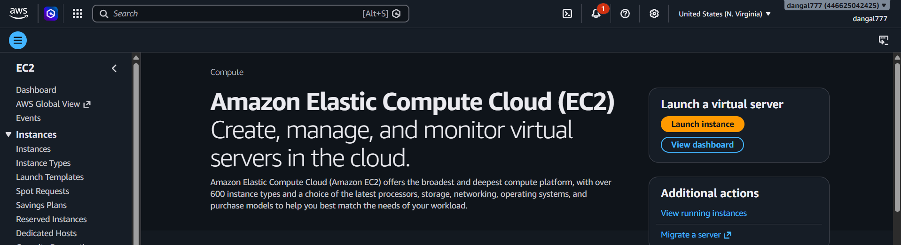
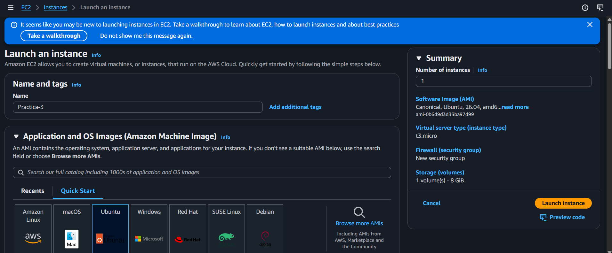
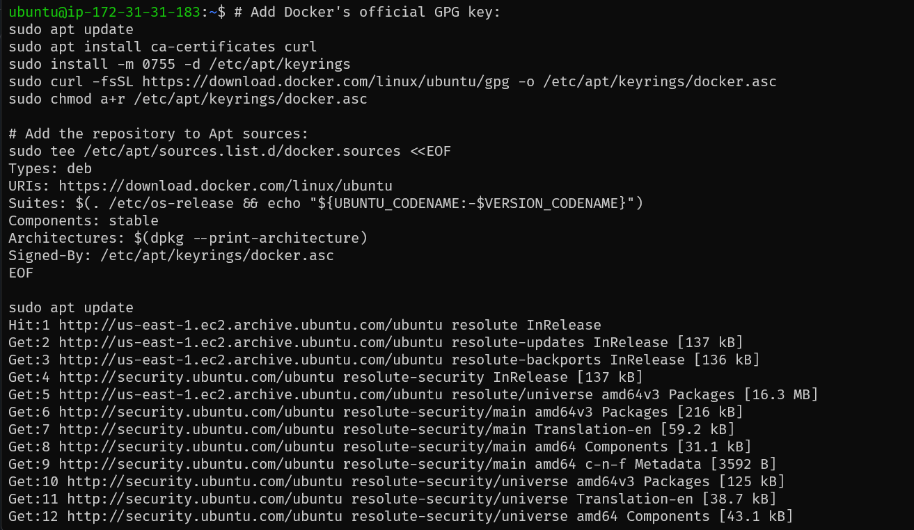
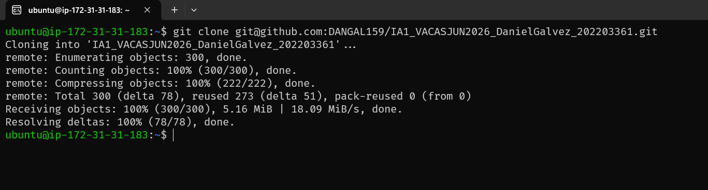
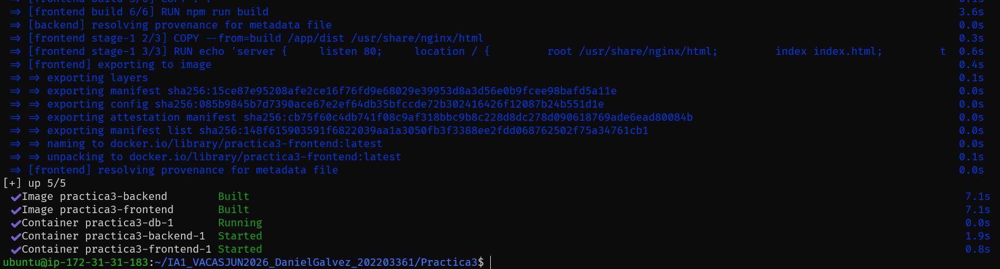
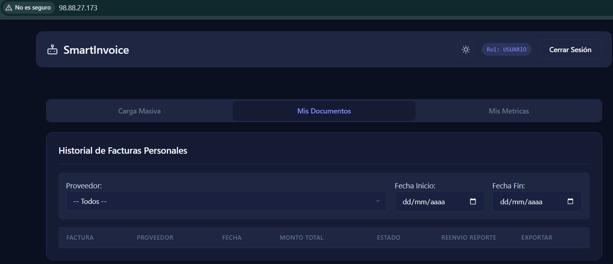

# Manual de Despliegue en la Nube - SmartInvoice OCR y RPA

Este manual describe el procedimiento técnico secuencial para realizar el aprovisionamiento, configuración, descarga y ejecución de la plataforma inteligente SmartInvoice dentro de una instancia virtual en la nube de Amazon Web Services (AWS).

---

## Paso 1: Configuración y Aprovisionamiento del Servidor Virtual (EC2)

Para alojar las cargas de trabajo que involucran procesamiento de imágenes con OpenCV y la ejecución de navegadores virtuales headless mediante Playwright, se requiere configurar una instancia computacional con recursos suficientes de memoria y procesamiento.

1. Ingrese a la consola de administración de AWS y diríjase al servicio EC2. Seleccione la opción **"Launch instance"** para crear una nueva instancia virtual.



2. Configure el sistema operativo seleccionando una imagen AMI basada en **Ubuntu Server 22.04 LTS** o superior. En la sección de tipo de instancia, elija una configuración que provea un mínimo de **2 vCPUs y 4 GB de memoria RAM** (se recomienda una instancia de la familia `t3.medium` o superior para mitigar la saturación por el uso de múltiples hilos de ejecución de Chromium).



3. Dentro de la sección de redes, configure las reglas del **Grupo de Seguridad (Security Group)** para exponer el acceso al exterior. Debe habilitar obligatoriamente las siguientes reglas de entrada de tráfico:
   - **Puerto 22 (SSH)**: Restringido a su dirección IP para la administración remota de la consola.
   - **Puerto 80 (HTTP)**: Abierto a cualquier dirección (`0.0.0.0/0`) para permitir el acceso público a la interfaz web unificada por Nginx.

4. Descargue la llave privada criptográfica (`.pem`) asociada a su instancia para asegurar la autenticación SSH posterior. **Importante**: Guarde este archivo en un lugar seguro, ya que no podrá recuperarlo si lo pierde.

---

## Paso 2: Conexión Remota e Instalación del Motor Docker

Una vez que la instancia cambie su estado operativo a **"Running"** en la consola de AWS, proceda a establecer una sesión de terminal para preparar el sistema operativo host.

1. Abra su consola local de comandos (PowerShell o Terminal Linux) y conéctese a la IP pública asignada por AWS mediante SSH:

```bash
ssh -i "su_llave_criptografica.pem" ubuntu@IP_PUBLICA_AWS
```

2. Ejecute la actualización completa de los repositorios de paquetes del sistema para garantizar la compatibilidad de las librerías:

```bash
sudo apt-get update && sudo apt-get upgrade -y
```

3. Instale el motor Docker y el plugin de Docker Compose de forma oficial mediante los repositorios de utilidades del sistema. Active los privilegios necesarios para asegurar el arranque automático del servicio:

```bash
sudo apt-get install docker.io docker-compose-v2 -y
sudo systemctl enable docker
sudo systemctl start docker
```

4. Verifique que Docker se haya instalado correctamente consultando la versión:

```bash
docker --version
docker compose version
```



---

## Paso 3: Obtención del Código Fuente mediante Control de Versiones

Con el entorno de contenedores preparado en la máquina virtual, se debe clonar la rama de producción del proyecto para transferir la lógica de la API, el frontend estático y los manuales técnicos.

1. Asegure el canal de comunicación e invoque la herramienta de control de versiones de Git instalada en el sistema de AWS:

```bash
git clone https://github.com/su-usuario/su-repositorio.git
```

2. Ingrese al directorio raíz de la aplicación y ubíquese en la carpeta específica asignada para la Práctica 3:

```bash
cd IA1_VACASJUN2026_DanielGalvez_202203361/Practica3
```



---

## Paso 4: Configuración de Variables de Entorno y Orquestación

Antes de compilar la infraestructura, se debe poblar el archivo de variables que alimentará los contenedores relacionales y de mensajería para evitar que datos sensibles queden expuestos en el código fuente.

1. Cree y edite el archivo `.env` dentro del directorio del backend (`backend/.env`) utilizando el editor de consola `nano`:

```bash
nano backend/.env
```

2. Configure las variables de entorno relativas a su negocio, inyectando:
   - **Token criptográfico secreto de JWT** para la autenticación segura
   - **Credenciales del relevo SMTP de Brevo** para la distribución automática de reportes por correo electrónico
   - **Credenciales de la base de datos PostgreSQL** (usuario, contraseña, nombre de la base de datos)

3. Guarde las modificaciones en el editor presionando `CTRL+O`, confirme con `Enter`, y salga con `CTRL+X`.

4. Inicie el proceso de descarga de imágenes base de Linux Alpine, compilación de dependencias binarias de OpenCV, descarga de bibliotecas de Tesseract en idioma español e instalación secuencial de los motores Headless de Playwright ejecutando el orquestador Compose con banderas de construcción en segundo plano:

```bash
sudo docker compose up --build -d
```



**Nota**: Este proceso puede tomar entre 5 y 15 minutos dependiendo de la velocidad de conexión a internet de la instancia EC2. Puede monitorear el progreso en tiempo real con:

```bash
sudo docker compose logs -f
```

---

## Paso 5: Verificación del Acceso y Conectividad Externa

El sistema se habrá desplegado de manera exitosa si las capas de Nginx, FastAPI y PostgreSQL se enlazan correctamente a través de la red interna creada por Docker.

1. Verifique el estado operativo de los contenedores remotos asegurando que todos muestren el estado **"Up"** y no existan bucles de reinicio forzado:

```bash
sudo docker compose ps
```

2. Abra un navegador de internet en su computadora local e ingrese la dirección IP pública de la instancia de AWS EC2 sin especificar puertos en la barra de direcciones (por defecto cargará a través del puerto 80):

```text
http://IP_PUBLICA_AWS_EC2
```

3. El sistema cargará el formulario de autenticación segura. Al realizar peticiones de inicio de sesión o procesar facturas masivas por la interfaz web, el tráfico se redirigirá internamente de forma dinámica hacia el backend gracias al Reverse Proxy de Nginx, certificando la completa autonomía, robustez y portabilidad de la plataforma SmartInvoice en la infraestructura de nube.



---

## Solución de Problemas Comunes

### Los contenedores no inician correctamente
```bash
# Ver los logs detallados de todos los servicios
sudo docker compose logs

# Reiniciar un servicio específico
sudo docker compose restart backend
```

### No puede acceder a la aplicación desde el navegador
- Verifique que el Security Group tenga habilitado el puerto 80 para `0.0.0.0/0`
- Confirme que la instancia EC2 esté en estado "Running"
- Verifique que los contenedores estén activos con `sudo docker compose ps`

### Errores de conexión a la base de datos
```bash
# Verificar que PostgreSQL esté corriendo
sudo docker compose ps postgres

# Reiniciar el servicio de base de datos
sudo docker compose restart postgres
```

---

## Comandos Útiles de Mantenimiento

```bash
# Detener todos los contenedores
sudo docker compose down

# Reiniciar todos los servicios
sudo docker compose restart

# Actualizar la aplicación después de cambios en el código
git pull
sudo docker compose up --build -d

# Acceder a la consola de un contenedor específico
sudo docker compose exec backend bash
sudo docker compose exec postgres psql -U usuario -d base_datos
```