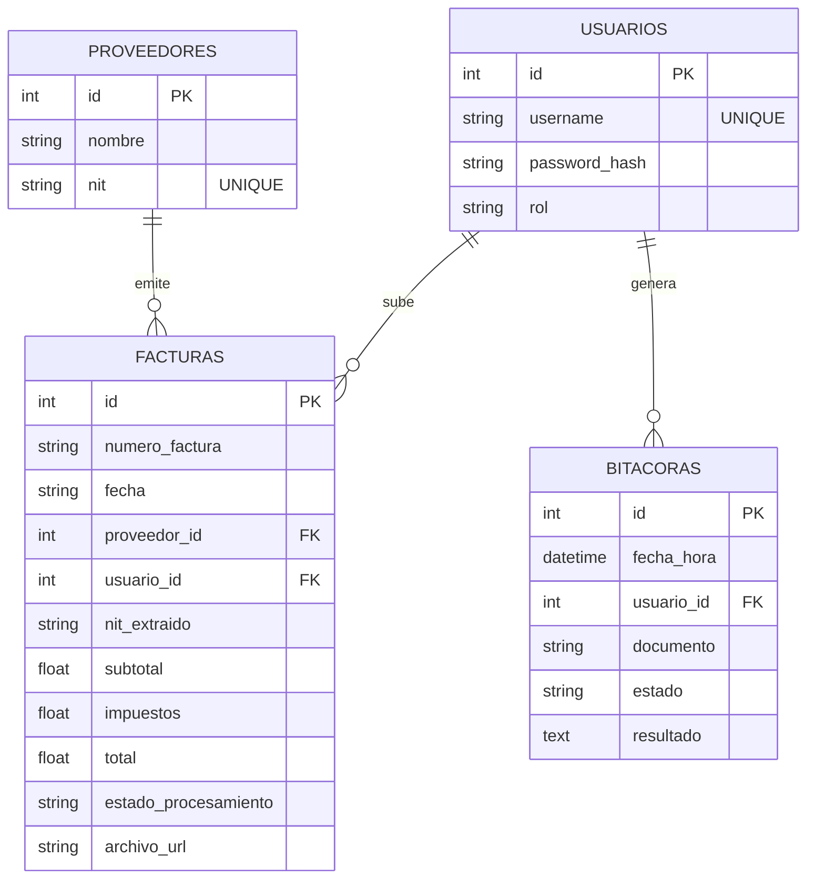

# Manual Técnico - SmartInvoice OCR y RPA

**Universidad de San Carlos de Guatemala** **Facultad de Ingeniería - Escuela de Ciencias y Sistemas** **Inteligencia Artificial 1** **Estudiante:** Daniel Gálvez - 202203361

---

## Introducción

En el entorno empresarial contemporaneo, la gestion contable representa uno de los procesos mas criticos y susceptibles a errores humanos. La digitacion manual de datos provenientes de facturas en formato fisico o digital consume recursos significativos de tiempo y personal, incrementando el riesgo de inconsistencias que pueden derivar en sanciones fiscales, perdidas economicas y deterioro de la reputacion corporativa. Ante este escenario, la convergencia entre la Inteligencia Artificial y la Automatizacion Robótica de Procesos (RPA) emerge como una alternativa viable para transformar flujos de trabajo tradicionales en operaciones eficientes, precisas y escalables.

El presente documento constituye el manual tecnico del sistema **SmartInvoice**, una plataforma integral desarrollada como proyecto final del curso de **Inteligencia Artificial 1** de la Escuela de Ciencias y Sistemas de la Facultad de Ingeniería de la Universidad de San Carlos de Guatemala. El sistema aborda el problema de la extraccion, validacion e inyeccion automatica de datos contables mediante la combinacion de tecnicas de Vision por Computadora (OCR), automatizacion de navegadores (RPA) y arquitecturas de software modernas basadas en microservicios.

SmartInvoice no se limita a ser un simple extractor de texto. El sistema implementa un flujo de trabajo completo que abarca desde la recepcion de documentos en multiples formatos, pasando por el procesamiento inteligente con filtros de expresiones regulares para garantizar la calidad de los datos, hasta la validacion humana intermedia y la posterior automatizacion de la entrada de informacion en sistemas ERP mediante robots de software. Esta aproximacion hibrida, que combina la capacidad de procesamiento masivo de la IA con el criterio humano en puntos criticos de decision, refleja las mejores practicas actuales en la implementacion de soluciones de automatizacion inteligente.

El manual esta estructurado para proporcionar una vision completa del sistema, desde su concepcion arquitectonica hasta su despliegue operativo. Se detallan los componentes tecnologicos que conforman el ecosistema (FastAPI, React, PostgreSQL, Tesseract OCR, Playwright), el modelo relacional de datos que garantiza la integridad referencial, los endpoints de la API REST que exponen las funcionalidades del sistema, y los procedimientos de despliegue mediante contenedores Docker. Asimismo, se incluye un registro visual exhaustivo que documenta el comportamiento del sistema en escenarios reales de uso.

El objetivo principal de este documento es servir como referencia tecnica para desarrolladores, administradores de sistemas y usuarios avanzados que deseen comprender, mantener o extender la plataforma SmartInvoice. A traves de sus paginas, se busca no solo describir el funcionamiento del sistema, sino tambien transmitir las decisiones de diseño, los patrones arquitectonicos aplicados y las lecciones aprendidas durante su desarrollo, contribuyendo asi al acervo de conocimiento en el area de la automatizacion inteligente de procesos contables dentro del contexto academico y profesional guatemalteco.

## 1. Descripción General del Sistema

**SmartInvoice** es una plataforma integral de inteligencia artificial enfocada en la automatización de flujos de trabajo contables. El sistema permite la extracción automática de datos a partir de facturas en formato imagen o PDF utilizando técnicas de Visión por Computadora (OCR), su validación humana intermedia, y la posterior inyección automática de estos datos en un sistema ERP simulado mediante la tecnología de Automatización Robótica de Procesos (RPA).

El ecosistema cuenta con control de acceso basado en roles (RBAC), generación de reportes multiformato (CSV, Excel, PDF), envío de notificaciones vía SMTP y dashboards analíticos interactivos. Toda la arquitectura está orquestada mediante **Docker Compose**, asegurando persistencia de datos y evidencias operativas.

---

## 2. Arquitectura Implementada

El código fuente respeta la separación de responsabilidades, aislando los motores de inteligencia artificial y automatización en el backend y delegando la visualización a una aplicación de página única (SPA).

```text
Practica3/
 ├── backend/                       # API RESTful, Motor OCR y Scripts RPA (FastAPI)
 │   ├── config/                    # Configuración de base de datos (SQLAlchemy)
 │   ├── evidencias/                # Volumen mapeado para capturas de Playwright
 │   ├── models/                    # Definición de entidades relacionales (ORM)
 │   ├── routers/                   # Endpoints HTTP segmentados (Auth, Facturas)
 │   ├── services/                  # Lógica OCR, RPA (Playwright) y Reportes SMTP
 │   ├── .env                       # Variables de entorno y llaves criptográficas (JWT)
 │   ├── Dockerfile                 # Contenedor Python con Tesseract y Chromium
 │   ├── main.py                    # Punto de entrada ASGI y montaje de archivos estáticos
 │   └── requirements.txt           # Dependencias de Python
 ├── frontend/                      # Capa de presentación y Dashboards Analíticos (React)
 │   ├── public/                    # Recursos estáticos
 │   ├── src/                       # Código fuente de la interfaz
 │   │   ├── api/                   # Cliente Axios centralizado con interceptores JWT
 │   │   ├── components/            # Componentes reutilizables (Modales, Exportaciones)
 │   │   ├── pages/                 # Vistas segregadas (Login, AdminDashboard, UserDashboard)
 │   │   ├── App.jsx                # Enrutador principal y control de tema (Claro/Oscuro)
 │   │   ├── main.jsx               # Punto de entrada de React
 │   │   └── App.css                # Estilos globales y diseño modular
 │   ├── Dockerfile                 # Imagen multi-stage (Vite Build + Nginx)
 │   └── package.json               # Dependencias de Node.js (Recharts, Axios)
 ├── docs/                          # Documentación técnica e imágenes
 └── docker-compose.yml             # Orquestador global de contenedores

```

### 2.1 Patrón Arquitectónico (Cliente-Servidor + MVC)


El sistema adopta una arquitectura Cliente-Servidor. El Backend implementa el patrón **Modelo-Vista-Controlador (MVC)**, exponiendo las interfaces para el consumo del Frontend:

* **Modelos:** Capa de abstracción de datos en PostgreSQL mediante SQLAlchemy.
* **Vistas:** Interfaces construidas en React, adaptadas estructuralmente para dos roles: Administrador y Usuario Cliente.
* **Controladores:** Enrutadores de FastAPI que validan reglas de negocio, firmas criptográficas de tokens y gestionan la entrada/salida de archivos (Multipart/form-data).

### 2.2 Tecnologías Utilizadas

* **Backend:** Python 3.11, FastAPI, Uvicorn, SQLAlchemy.
* **Inteligencia Artificial y OCR:** OpenCV, Pytesseract (Tesseract OCR).
* **Automatización RPA:** Playwright (Chromium Headless).
* **Generación de Reportes:** ReportLab (PDF), OpenPyxl (Excel), módulo CSV nativo.
* **Notificaciones:** Relay SMTP de Brevo.
* **Base de Datos:** PostgreSQL 15.
* **Frontend:** React, Vite, Axios, Recharts (Gráficas interactivas).
* **DevOps y Seguridad:** Docker, Nginx, Bcrypt, JWT (JSON Web Tokens).

---

## 3. Modelo Relacional de Base de Datos

La persistencia se maneja en PostgreSQL, asegurando la integridad referencial para evitar inconsistencias en las métricas al modificar proveedores o usuarios.

### 3.1 Diagrama Entidad-Relación (ER)



### 3.2 Descripción de Entidades Principales

1. **Usuarios:** Gestiona el control de acceso. Incluye la columna `rol` para diferenciar entre clientes estándar y administradores globales.
2. **Proveedores:** Directorio centralizado. Su integración evita redundancia de datos y permite filtrar métricas con alta precisión.
3. **Facturas:** Entidad transaccional core. Almacena los 7 campos obligatorios extraídos, el estado lógico de la operación y la ruta física a la evidencia generada por el RPA.
4. **Bitácoras:** Registro inmutable de eventos operacionales, trazando marcas temporales, origen del evento y estados de éxito o error técnico.

---

## 4. Lógica de Procesamiento Inteligente

El flujo del sistema reemplaza el trabajo manual mediante cuatro componentes de procesamiento.

### 4.1 Extracción OCR y Expresiones Regulares

Al recibir un lote de imágenes o PDFs, el sistema estandariza los formatos mediante binarización. Tesseract extrae el texto crudo y un motor de Expresiones Regulares (RegEx) mapea de manera estricta variables como NIT, Totales e Impuestos, aislando falsos positivos (e.g., ignorando la palabra "SUBTOTAL" al buscar el "TOTAL").

### 4.2 Control de Concurrencia (Locking)

El frontend emplea banderas de bloqueo de estado (State Locking) para prevenir la duplicación de registros por condiciones de carrera si un usuario hace clics múltiples durante el procesamiento masivo secuencial.

### 4.3 Automatización RPA

Una vez aprobados los datos, el servicio RPA levanta un navegador virtual asíncrono, renderiza un formulario DOM simulado, inyecta los valores extraídos mediante selectores CSS, genera una captura de pantalla única (`timestamp-evidencia.png`) y la almacena en un volumen físico montado en Docker.

### 4.4 Reportería Multiformato y Notificaciones

Tras la ejecución del robot, el sistema puede compilar la información en estructuras binarias (PDF, XLSX) utilizando búferes en memoria (`io.BytesIO`) y transmitirlas bajo demanda, o despachar confirmaciones vía correo electrónico usando una sesión autenticada hacia servidores SMTP externos [Brevo].

---

## 5. Endpoints de la API REST

| Módulo | Endpoint | Método | Descripción |
| --- | --- | --- | --- |
| **Autenticación** | `/auth/login` | POST | Intercambio de credenciales por JWT válido. |
|  | `/auth/register` | POST | Creación de nuevos usuarios con hashing bcrypt. |
| **Facturación** | `/facturas/extraer` | POST | Recibe `multipart/form-data` y retorna JSON del OCR. |
|  | `/facturas/confirmar` | POST | Dispara el proceso RPA, guarda datos y bitácora. |
|  | `/facturas/rechazar` | POST | Archiva el registro sin ejecutar RPA. |
|  | `/facturas/{id}/exportar` | GET | Devuelve blobs binarios según formato (csv, pdf, xlsx). |
|  | `/facturas/{id}/reenviar` | POST | Automatiza envío de correo bajo demanda. |
| **Entidades** | `/facturas/proveedores` | GET, POST, PUT, DELETE | CRUD completo con validación referencial. |
|  | `/auth/usuarios/{id}` | PUT, DELETE | Gestión administrativa de accesos. |

---

## 6. Despliegue y Ejecución (Docker)

El sistema requiere la construcción local de las dependencias pesadas de IA y Navegación.

### Instrucciones de Despliegue

1. Asegurar la configuración de variables en `backend/.env` (Credenciales SMTP y firma JWT).
2. Ejecutar el orquestador en la raíz del proyecto para descargar Tesseract, compilar librerías C++ de OpenCV y descargar binarios de Chromium:

```bash
docker compose up --build -d

```

3. El panel web estará expuesto en `http://localhost`.
4. La base de datos se inicializará y el volumen de evidencias se enlazará automáticamente al directorio `./backend/evidencias`.

---

## 7. Evidencias Visuales

A continuacion se presenta el registro visual del funcionamiento del sistema SmartInvoice, abarcando desde la arquitectura general hasta las interfaces de usuario y los paneles administrativos.

### 7.1 Diagrama de Arquitectura


*Figura 1: Diagrama de arquitectura del sistema SmartInvoice. Se aprecia la distribucion en capas (Presentacion, Logica, Motores de IA/RPA, Persistencia e Integraciones Externas), asi como los flujos de datos entre el Frontend en React, el Backend en FastAPI, los motores de OCR y Playwright, y la base de datos PostgreSQL.*

---

### 7.2 Modulo de Autenticacion


*Figura 2: Pantalla de inicio de sesion y registro de usuarios. El sistema valida las credenciales contra la tabla `USUARIOS` aplicando hashing bcrypt, y tras la autenticacion exitosa emite un JWT que es almacenado en el cliente mediante interceptores de Axios para las peticiones subsecuentes.*

---

### 7.3 Panel Administrativo - Auditoria


*Figura 3: Vista de auditoria del administrador. Esta interfaz consume la tabla `BITACORAS` y presenta un registro inmutable de todas las operaciones realizadas en el sistema, incluyendo marcas temporales, usuario responsable, documento procesado y estado final de la operacion (exito o error tecnico).*

---

### 7.4 Panel Administrativo - Gestion de Proveedores


*Figura 4: Modulo de gestion de proveedores. Permite realizar operaciones CRUD completas sobre la entidad `PROVEEDORES`, asegurando la integridad referencial mediante la columna `nit` con restriccion `UNIQUE`. La centralizacion de este directorio evita la redundancia de datos al momento de vincular facturas.*

---

### 7.5 Panel Administrativo - Gestion de Clientes


*Figura 5: Administracion de usuarios clientes. El administrador global tiene la capacidad de crear, modificar o inhabilitar cuentas de usuario, asignando el rol correspondiente mediante la columna `rol` en la tabla `USUARIOS`. Esto garantiza el control de acceso basado en roles (RBAC) del ecosistema.*

---

### 7.6 Panel Administrativo - Metricas Globales


*Figura 6: Dashboard analitico del administrador. Se presentan metricas agregadas en tiempo real mediante la libreria Recharts, incluyendo volumenes de facturas procesadas por proveedor, tasas de exito del OCR, distribucion de estados y volumenes de procesamiento por periodo. Los datos se obtienen mediante consultas optimizadas sobre las entidades relacionales.*

---

### 7.7 Panel Administrativo - Logs RPA


*Figura 7: Registro detallado de ejecuciones del robot RPA. Cada entrada documenta la interaccion del navegador virtual Chromium Headless con el sistema ERP simulado, incluyendo los selectores CSS utilizados para la inyeccion de datos, la ruta de la evidencia generada (`timestamp-evidencia.png`) y el resultado de la operacion automatizada.*

---

### 7.8 Interfaz de Usuario - Carga Masiva de Facturas


*Figura 8: Interfaz de carga masiva de documentos. El usuario cliente puede subir multiples facturas en formato imagen o PDF mediante peticiones `multipart/form-data`. El frontend implementa banderas de bloqueo de estado (State Locking) para prevenir la duplicacion de registros por condiciones de carrera durante el procesamiento secuencial.*

---

### 7.9 Interfaz de Usuario - Historial de Documentos


*Figura 9: Listado de documentos procesados por el usuario. Se muestran las facturas con su estado de procesamiento actual, los datos extraidos por el motor OCR (NIT, subtotal, impuestos, total) y las acciones disponibles: confirmar para disparar el flujo RPA, rechazar para archivar sin ejecucion, o exportar en formatos CSV, Excel o PDF.*

---

### 7.10 Interfaz de Usuario - Metricas Personales


*Figura 10: Dashboard de metricas del usuario cliente. Presenta estadisticas personalizadas sobre la actividad del usuario, incluyendo total de facturas cargadas, tasa de aprobacion, distribucion por proveedor y volumenes de procesamiento mensual. Esta vista permite al usuario llevar un control independiente de sus operaciones contables dentro de la plataforma.*

## 8. Conclusiones

El desarrollo del sistema **SmartInvoice** ha permitido consolidar una solucion integral que demuestra la viabilidad de combinar tecnicas de Inteligencia Artificial con Automatizacion Robótica de Procesos en un entorno contable real. A continuacion se detallan las principales conclusiones derivadas de la implementacion:

### 8.1 Integracion Efectiva de OCR y RPA

La combinacion de **Tesseract OCR** con un motor de **Expresiones Regulares** demostro ser un enfoque robusto para la extraccion de datos estructurados a partir de documentos no nativos digitales. La fase intermedia de validacion humana resulto ser un componente critico del flujo, ya que permite depurar los falsos positivos que el OCR pudiera generar antes de que el robot RPA inyecte los datos en el sistema ERP. Este esquema hibrido (IA + supervision humana + automatizacion) reduce significativamente la tasa de error en comparison con un proceso completamente manual o completamente automatizado sin supervision.

### 8.2 Arquitectura Modular y Escalable

La adopcion del patron **Cliente-Servidor con MVC**, sumado al uso de **FastAPI** en el backend y **React** en el frontend, permitio una clara separacion de responsabilidades. Cada componente del sistema (extraccion, validacion, automatizacion, reporteria) puede evolucionar de manera independiente sin afectar al resto del ecosistema. La orquestacion mediante **Docker Compose** garantiza que el despliegue sea reproducible en cualquier entorno, eliminando las inconsistencias tipicas del desarrollo local y facilitando la portabilidad hacia infraestructuras de produccion.

### 8.3 Trazabilidad y Auditoria Completa

La implementacion de la entidad **BITACORAS** junto con el almacenamiento fisico de las capturas generadas por Playwright en volumenes Docker mapeados, asegura que cada operacion del sistema quede debidamente registrada. Este nivel de trazabilidad es particularmente valioso en contextos contables y financieros, donde la evidencia operativa y la capacidad de auditar cada transaccion son requisitos normativos fundamentales.

### 8.4 Seguridad y Control de Acceso

El sistema implementa multiples capas de seguridad: hashing de contrasenas con **bcrypt**, autenticacion mediante **JWT** con firmas criptograficas, interceptores en el frontend para la gestion automatica de tokens, y un modelo **RBAC** que segrega las funcionalidades entre administradores y usuarios clientes. Estas medidas garantizan que solo los actores autorizados puedan ejecutar operaciones sensibles, como la gestion de proveedores o la aprobacion de facturas para inyeccion en el ERP.
