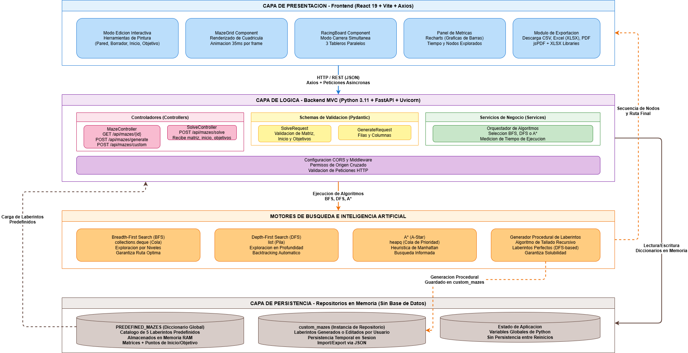

# Manual Técnico - RoboMaze

**Universidad de San Carlos de Guatemala**  
**Facultad de Ingeniería - Escuela de Ciencias y Sistemas**  
**Inteligencia Artificial 1**  
**Estudiante:** Daniel Gálvez - 202203361

---

## Introducción

En el campo de la Inteligencia Artificial, la resolución de problemas de navegación y búsqueda de rutas en espacios de estados constituye uno de los pilares fundamentales para el desarrollo de sistemas autónomos, robótica móvil e inteligencia artificial en videojuegos. La capacidad de un agente para desplazarse desde un punto inicial hasta uno o múltiples objetivos, evitando obstáculos y optimizando recursos, requiere la implementación de algoritmos de exploración eficientes y la capacidad de analizar su rendimiento en entornos dinámicos.

El presente documento constituye el manual técnico del sistema RoboMaze, una plataforma web interactiva desarrollada como parte del curso de Inteligencia Artificial 1 de la Escuela de Ciencias y Sistemas. El sistema aborda el problema de la búsqueda de rutas mediante la representación de laberintos en cuadrículas bidimensionales, permitiendo la ejecución, visualización paso a paso y comparación analítica de los algoritmos clásicos de búsqueda no informada (Breadth-First Search y Depth-First Search) e informada (A*).

RoboMaze no se limita a calcular rutas; el sistema implementa un entorno de simulación completo que abarca desde la generación procedural de laberintos y la edición manual de obstáculos, hasta la ejecución simultánea de múltiples algoritmos en modo carrera. Esta aproximación pedagógica y técnica permite contrastar empíricamente el comportamiento de las estructuras de datos subyacentes (colas, pilas y colas de prioridad) y las funciones heurísticas, generando métricas precisas de tiempo de ejecución y nodos explorados.

El manual está estructurado para proporcionar una visión completa de la arquitectura de software, detallando la separación de responsabilidades entre el backend en Python (FastAPI) y el frontend en React. Se describen los esquemas de validación de datos, la lógica matemática de los algoritmos de búsqueda, los endpoints de la API REST y los procedimientos de despliegue. Asimismo, se incluye un registro visual exhaustivo que documenta el comportamiento del sistema en escenarios de edición, resolución y comparativa de algoritmos.

---

## 1. Descripción General del Sistema

RoboMaze es una aplicación web de página única (SPA) enfocada en la simulación y análisis de algoritmos de búsqueda en grafos. El sistema permite la creación, carga y modificación de laberintos, y procesa las solicitudes de resolución en el backend para devolver las secuencias de exploración y las rutas óptimas, las cuales son animadas en el frontend para su estudio visual.

### 1.1 Requerimientos Funcionales

Los requerimientos funcionales definen las capacidades operativas que el sistema RoboMaze debe ejecutar para satisfacer los objetivos de la práctica:

- **RF-01: Generación y Carga de Laberintos:** El sistema debe permitir cargar al menos 5 laberintos predefinidos, generar laberintos aleatorios de dimensiones variables mediante algoritmos de tallado recursivo, y crear cuadrículas vacías para edición manual.

- **RF-02: Modo de Edición Interactiva:** La interfaz debe permitir al usuario pintar obstáculos (paredes), borrar celdas, y definir de forma dinámica un punto de inicio y múltiples puntos objetivo mediante herramientas de selección.

- **RF-03: Resolución Individual y Animada:** El sistema debe permitir ejecutar los algoritmos BFS, DFS y A* de forma independiente, devolviendo la secuencia exacta de nodos explorados y la ruta final para su animación paso a paso en el frontend.

- **RF-04: Recálculo Dinámico en Tiempo Real:** Si el usuario modifica el laberinto (agrega paredes, cambia el inicio o los objetivos) mientras el sistema está en modo de resolución estática, la interfaz debe disparar automáticamente un nuevo cálculo de ruta.

- **RF-05: Modo Comparativo (Carrera):** El sistema debe permitir ejecutar BFS, DFS y A* de forma simultánea sobre el mismo laberinto, renderizando tres tableros paralelos que animan la exploración de cada algoritmo al mismo tiempo.

- **RF-06: Extracción y Visualización de Métricas:** El sistema debe calcular y mostrar el tiempo de ejecución en milisegundos y la cantidad total de nodos explorados por cada algoritmo, presentando estos datos en paneles informativos y gráficas de barras comparativas.

- **RF-07: Exportación de Reportes de Rendimiento:** El sistema debe permitir la descarga local de las métricas obtenidas (individuales o comparativas) en tres formatos específicos: hojas de cálculo Excel (XLSX), documentos PDF con tablas estructuradas y archivos CSV.

- **RF-08: Persistencia de Estado Local (Import/Export):** El usuario debe poder descargar el estado actual del laberinto (matriz, inicio, objetivos) en formato JSON y cargarlo posteriormente para restaurar el entorno de trabajo.

### 1.2 Requerimientos No Funcionales

Los requerimientos no funcionales especifican las restricciones técnicas, criterios de calidad y propiedades de la arquitectura:

- **RNF-01: Ausencia de Bases de Datos Relacionales:** En estricto cumplimiento con las restricciones del enunciado, el sistema no debe utilizar motores de bases de datos (como PostgreSQL o MySQL). El estado de los laberintos predefinidos y personalizados debe manejarse mediante estructuras de datos en memoria (diccionarios de Python y estado de React).

- **RNF-02: Arquitectura Desacoplada y Comunicación REST:** La lógica pesada de los algoritmos de búsqueda debe ejecarse exclusivamente en el backend (Python), mientras que el frontend (React) se encargará únicamente de la renderización, animación y captura de interacciones, comunicándose mediante peticiones HTTP asíncronas (Axios).

- **RNF-03: Rendimiento de Animación y Concurrencia Visual:** El frontend debe implementar un mecanismo de intervalos temporales (35ms por frame) para renderizar la exploración de nodos de forma fluida, permitiendo al usuario detener la animación manualmente sin bloquear el hilo principal de la interfaz.

- **RNF-04: Escalabilidad de la Interfaz Gráfica:** El tamaño de las celdas de la cuadrícula debe ajustarse dinámicamente mediante variables CSS en función de las dimensiones del laberinto y del modo de visualización (edición estándar vs. modo carrera de tres tableros), garantizando que la interfaz no desborde el viewport.

- **RNF-05: Validación Estricta de Datos (Schemas):** Toda petición entrante a la API REST debe ser validada mediante modelos de Pydantic, asegurando que las matrices, coordenadas de inicio/objetivo y nombres de algoritmos cumplan con la estructura esperada antes de llegar a la capa de servicio.

---

## 2. Arquitectura Implementada



El código fuente respeta la separación de responsabilidades, aislando los motores de búsqueda en el backend y delegando la visualización y el estado de la interfaz a una aplicación de página única.

```
/Practica4/
 ├── backend/                       # API RESTful y Motores de Búsqueda (FastAPI)
 │   ├── controllers/               # Endpoints HTTP y enrutamiento
 │   ├── repositories/              # Manejo de estado en memoria (Laberintos predefinidos)
 │   ├── schemas/                   # Modelos de validación de datos (Pydantic)
 │   ├── services/                  # Lógica de negocio (BFS, DFS, A*, Generación)
 │   ├── main.py                    # Punto de entrada ASGI y configuración CORS
 │   └── requirements.txt           # Dependencias de Python
 ├── frontend/                      # Capa de presentación y Animación (React)
 │   ├── public/                    # Recursos estáticos e iconografía
 │   ├── src/                       # Código fuente de la interfaz
 │   │   ├── api/                   # Cliente Axios centralizado
 │   │   ├── components/            # Componentes reutilizables (MazeGrid, RacingBoard)
 │   │   ├── layouts/               # Estructura principal de la aplicación
 │   │   ├── pages/                 # Vista principal (RoboMaze) con lógica de estado
 │   │   ├── App.jsx                # Enrutador y control de tema (Claro/Oscuro)
 │   │   └── main.jsx               # Punto de entrada de React
 │   ├── package.json               # Dependencias de Node.js (Recharts, jsPDF, XLSX)
 │   └── vite.config.js             # Configuración del bundler Vite
 └── docs/                          # Documentación técnica e imágenes
```

### 2.1 Patrón Arquitectónico (Cliente-Servidor + Capas)

El sistema adopta una arquitectura Cliente-Servidor. El Backend implementa un patrón de Capas (Controller-Service-Repository) para mantener la lógica de búsqueda aislada de la comunicación HTTP:

- **Controladores (Controllers):** Reciben las peticiones HTTP, validan la estructura básica y delegan la tarea a los servicios.
- **Servicios (Services):** Contienen la implementación pura de los algoritmos de Inteligencia Artificial (BFS, DFS, A*) y la lógica de generación procedural.
- **Repositorios (Repositories):** Gestionan el almacenamiento efímero en memoria, manteniendo el catálogo de laberintos predefinidos y los creados por el usuario durante la sesión.
- **Vistas (Frontend SPA):** Construida en React, adapta el estado global para renderizar la cuadrícula, controlar los intervalos de animación y generar los reportes de exportación.

### 2.2 Tecnologías Utilizadas

- **Backend:** Python 3.x, FastAPI, Uvicorn, Pydantic.
- **Inteligencia Artificial:** Implementación nativa de BFS (collections.deque), DFS (pilas) y A* (heapq con heurística de Manhattan).
- **Frontend:** React 19, Vite, Axios.
- **Visualización de Datos y Reportes:** Recharts (gráficas interactivas), jsPDF con autotable (exportación PDF), XLSX (exportación Excel).
- **Control de Versiones:** Git y GitHub.

---

## 3. Modelo de Datos y Estado en Memoria

Dado que las restricciones del proyecto prohíben el uso de bases de datos, la persistencia y el modelado de datos se realizan mediante estructuras en memoria y esquemas de validación estrictos.

### 3.1 Esquemas de Validación (Pydantic)

La comunicación entre el frontend y el backend se rige por modelos de datos que garantizan la integridad de la información:

- **SolveRequest:** Recibe la matriz del laberinto (List[List[int]]), la tupla de inicio, la lista de tuplas de objetivos y el nombre del algoritmo.
- **GenerateRequest:** Recibe las dimensiones (filas y columnas) para la generación procedural.
- **CustomMazeRequest:** Recibe un identificador, la matriz, el inicio y los objetivos para guardar laberintos personalizados en la sesión.

### 3.2 Repositorio en Memoria

El backend utiliza un diccionario global (`PREDEFINED_MAZES`) que almacena las matrices de los 5 laberintos de prueba, junto con sus puntos de inicio y objetivo. Los laberintos generados o editados por el usuario se almacenan en un diccionario de instancia (`custom_mazes`) dentro del repositorio, los cuales persisten mientras el servicio backend mantenga su ejecución.

---

## 4. Lógica de Procesamiento Inteligente

El núcleo del sistema reside en la capa de servicios del backend, donde se implementan los algoritmos de búsqueda en espacios de estados.

### 4.1 Breadth-First Search (BFS)

Implementado mediante una cola (`deque`). El algoritmo explora el grafo nivel por nivel, garantizando que, al encontrar un objetivo, la ruta obtenida sea la más corta en términos de número de aristas. Retorna la secuencia exacta de nodos visitados para su posterior animación.

### 4.2 Depth-First Search (DFS)

Implementado mediante una pila (`list`). El algoritmo explora tan profundo como sea posible a lo largo de cada rama antes de retroceder (backtracking). Aunque no garantiza la ruta más corta, su comportamiento de exploración contrasta visualmente con el BFS, expandiéndose en forma de "ramas" profundas.

### 4.3 Algoritmo A* (A-Star)

Implementado mediante una cola de prioridad (`heapq`). Utiliza una función heurística basada en la Distancia de Manhattan para estimar el costo restante hacia el objetivo más cercano. Esto permite que el algoritmo dirija su exploración de manera inteligente, reduciendo drásticamente la cantidad de nodos explorados en comparación con los métodos no informados.

### 4.4 Generación Procedural de Laberintos

El sistema utiliza un algoritmo de tallado recursivo (basado en DFS) para generar laberintos perfectos (donde existe exactamente un camino entre dos puntos cualesquiera). El algoritmo comienza en una celda, marca los pasillos y abre paredes adyacentes de forma aleatoria, asegurando que el laberinto sea siempre resoluble.

---

## 5. Endpoints de la API REST

| Módulo | Endpoint | Método | Descripción |
|--------|----------|--------|-------------|
| Laberintos | `/api/mazes/{maze_id}` | GET | Obtiene la estructura de un laberinto predefinido o personalizado por su ID. |
| | `/api/mazes/generate` | POST | Recibe filas y columnas, retorna una matriz de laberinto generado aleatoriamente. |
| | `/api/mazes/custom` | POST | Guarda un laberinto editado por el usuario en el repositorio en memoria. |
| Búsqueda | `/api/mazes/solve` | POST | Recibe la matriz, inicio, objetivos y algoritmo. Retorna la ruta, nodos explorados y tiempo de ejecución. |

---

## 6. Despliegue y Ejecución

El sistema requiere la ejecución simultánea del servidor de desarrollo de Python y el bundler de Vite.

### Instrucciones de Despliegue

1. **Backend:** Navegar a la carpeta `backend`, crear un entorno virtual, instalar las dependencias (`fastapi`, `uvicorn`, `pydantic`) y ejecutar el servidor:
   ```bash
   uvicorn main:app --reload --port 8000
   ```

2. **Frontend:** Navegar a la carpeta `frontend`, instalar las dependencias de Node.js (`npm install`) y levantar el servidor de desarrollo:
   ```bash
   npm run dev
   ```

3. La interfaz web estará expuesta en el puerto local de Vite (generalmente `http://localhost:5173`), la cual consumirá la API REST mediante el cliente Axios configurado sin URL base absoluta para facilitar el proxy inverso o las peticiones locales.

---

## 7. Evidencias Visuales

A continuación se presenta el registro visual del funcionamiento del sistema RoboMaze, abarcando desde la edición de entornos hasta la comparativa de algoritmos.

### 7.1 Modo de Edición y Herramientas de Pintura

  
**Figura 1:** Interfaz principal en modo edición. Se aprecia el panel de controles izquierdo con las herramientas de pintura (pared, borrador, inicio, objetivo) y la cuadrícula bidimensional interactiva que permite al usuario diseñar laberintos personalizados.

### 7.2 Selector de Laberintos Predefinidos

  
**Figura 2:** Menú de selección de laberintos preconfigurados. El sistema cuenta con un catálogo de 5 laberintos de complejidad variable almacenados en el repositorio en memoria del backend, listos para ser cargados y sometidos a pruebas de rendimiento.

### 7.3 Interfaz General de Edición

  
**Figura 3:** Vista general del entorno de trabajo. Se observa la distribución de la SPA, con los paneles de control laterales, la cuadrícula central y el panel derecho destinado a las métricas de rendimiento y gráficas comparativas.

### 7.4 Opciones de Ejecución Individual

  
**Figura 4:** Panel de control para la ejecución secuencial. El usuario puede seleccionar el algoritmo deseado (BFS, DFS o A*) y disparar la animación paso a paso, observando cómo el frontend consume la secuencia de nodos explorados devuelta por el backend.

### 7.5 Opción de Comparación Simultánea

  
**Figura 5:** Botón de activación del modo carrera. Al presionar esta opción, el frontend realiza tres peticiones paralelas al backend y sincroniza la animación de los tres algoritmos para su análisis visual directo.

### 7.6 Comparativa Visual de Algoritmos (BFS vs DFS vs A*)

  
**Figura 6:** Renderizado del modo carrera. Se muestran tres tableros paralelos que ilustran el comportamiento de cada algoritmo. Es evidente cómo el BFS expande en forma de ondas, el DFS se adentra en ramas profundas, y el A* se dirige estratégicamente hacia el objetivo gracias a la heurística de Manhattan.

### 7.7 Gráfica de Rendimiento y Métricas

  
**Figura 7:** Dashboard de métricas analíticas. Utilizando la librería Recharts, el sistema genera gráficas de barras que contrastan la cantidad de nodos explorados y el tiempo de ejecución en milisegundos, proporcionando evidencia empírica de la eficiencia de cada algoritmo.

### 7.8 Opciones de Exportación de Rendimiento

  
**Figura 8:** Panel de exportación de datos. El sistema permite la descarga de las métricas obtenidas en formatos CSV, Excel (XLSX) y PDF, facilitando la inclusión de los resultados en informes técnicos o académicos.

### 7.9 Retorno al Modo Edición

  
**Figura 9:** Interfaz tras finalizar la animación o detenerla manualmente. El sistema limpia las secuencias de exploración, conserva la ruta final si se completó, y restaura el estado de la cuadrícula para permitir la edición dinámica y el recálculo en tiempo real.

---

## 8. Conclusiones

El desarrollo del sistema RoboMaze ha permitido materializar los conceptos teóricos de la búsqueda en espacios de estados, transformando estructuras de datos abstractas en representaciones visuales interactivas. A continuación se detallan las principales conclusiones derivadas de la implementación:

### 8.1 Validación Empírica de Algoritmos de Búsqueda

La implementación y posterior comparación visual de BFS, DFS y A* demuestra de manera contundente las ventajas y desventajas de cada enfoque. Mientras que BFS garantiza la optimalidad de la ruta en grafos no ponderados a costa de una exploración exhaustiva, y DFS reduce el uso de memoria pero genera rutas subóptimas, el algoritmo A* confirma su superioridad en entornos de cuadrícula al utilizar la heurística de Manhattan para minimizar drásticamente los nodos explorados y el tiempo de ejecución.

### 8.2 Importancia de la Arquitectura Desacoplada

La decisión de procesar la lógica de los algoritmos exclusivamente en el backend (Python) y delegar la animación al frontend (React) resultó ser fundamental para el rendimiento del sistema. Esta separación permite que el frontend no sufra bloqueos en el hilo principal de JavaScript al calcular rutas complejas, manteniendo la interfaz fluida y responsiva incluso en laberintos de grandes dimensiones.

### 8.3 Interactividad y Recálculo Dinámico

La capacidad del sistema para recalcular la ruta en tiempo real ante modificaciones del usuario (como la adición de nuevas paredes o el cambio de objetivos) simula el comportamiento de un agente autónomo que debe reaccionar a cambios en su entorno (obstáculos dinámicos). Esto eleva el valor pedagógico de la herramienta, yendo más allá de la simple ejecución estática.

### 8.4 Generación de Evidencia Analítica

La integración de herramientas de exportación (jsPDF, XLSX) y visualización de datos (Recharts) permite que el sistema no solo resuelva problemas, sino que genere reportes técnicos comparativos. Esta funcionalidad cumple con los estándares de ingeniería de software al proporcionar métricas cuantificables (tiempo y nodos) que sustentan la toma de decisiones respecto a la selección del algoritmo más adecuado para un escenario específico.